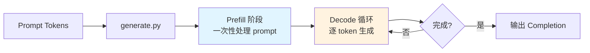
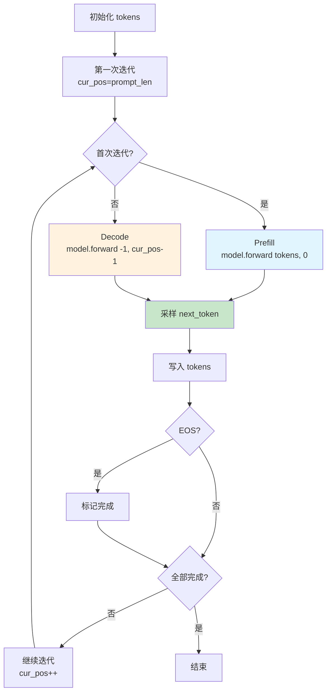
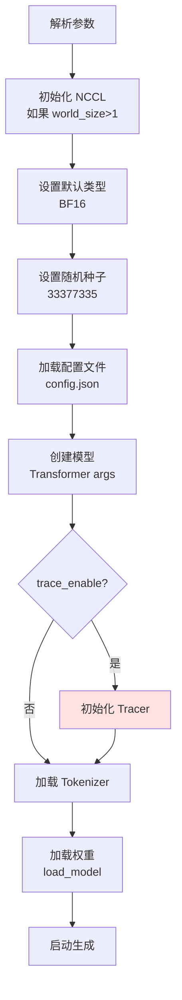

# GENERATE.md - 生成循环详解

## 目录

- [1. 概述](#1-概述)
- [2. sample 函数](#2-sample-函数)
- [3. generate 函数](#3-generate-函数)
- [4. main 函数](#4-main-函数)
- [5. 完整生成流程](#5-完整生成流程)

## 1. 概述

`generate.py` 是 DeepSeek-V3.2-Exp 的**生成入口**，负责：

1. 自回归 token 生成循环
2. 温度采样
3. DSA trace 集成
4. 交互模式和批处理模式



## 2. sample 函数

### 2.1 函数定义

**位置**: `generate.py:L31-L44`

```python
def sample(logits, temperature: float = 1.0):
    logits = logits / max(temperature, 1e-5)
    probs = torch.softmax(logits, dim=-1, dtype=torch.float32)
    return probs.div_(torch.empty_like(probs).exponential_(1).argmax(dim=-1)
```

### 2.2 采样方法

```mermaid
flowchart TD
    A[logits<br/>(vocab_size,)] --> B[除以温度<br/>logits / T]
    B --> C[Softmax<br/>probs]
    C --> D[Gumbel-Noise<br/>-log -log U]
    D --> E[Argmax<br/>采样 token]

    style B fill:#e1f5ff
    style D fill:#fff3e0
```

### 2.3 温度采样

**公式**：
$$ \text{token} = \arg\max_i \left( \frac{l_i}{T} - g_i \right) $$

其中：
- $l_i$ 是第 $i$ 个 token 的 logit
- $T$ 是温度（$>0$）
- $g_i = -\log(-\log u_i)$ 是 Gumbel 噪声，$u_i \sim U(0,1)$

**温度影响**：

| 温度 | 效果 |
|------|------|
| $T \to 0$ | 贪婪采样（argmax） |
| $T = 1$ | 标准采样 |
| $T > 1$ | 更随机，分布更平滑 |
| $T \to \infty$ | 均匀分布 |

### 2.4 代码等价性

```python
# Gumbel-softmax trick 实现方式 1
noise = -torch.log(-torch.log(torch.rand_like(probs)))
return (logits / temperature + noise).argmax(dim=-1)

# generate.py 的实现方式 2
return probs.div_(torch.empty_like(probs).exponential_(1)).argmax(dim=-1)
```

**等价性证明**：
- $u \sim U(0,1)$
- $-\log u \sim \text{Exp}(1)$（指数分布）
- $-\log(-\log u) \sim \text{Gumbel}(0,1)$
- `probs / Exponential(1)` 等价于 `log(probs) - log(Exponential(1))`

## 3. generate 函数

### 3.1 函数签名

**位置**: `generate.py:L47-L115`

```python
@torch.inference_mode()
def generate(
    model: Transformer,
    prompt_tokens: List[List[int]],
    max_new_tokens: int,
    eos_id: int,
    temperature: float = 1.0,
    request_ids: Optional[Sequence[int]] = None,
    prefix_infos: Optional[Sequence[ds_trace.RequestPrefixInfo]] = None,
) -> List[List[int]]:
```

### 3.2 参数说明

| 参数 | 类型 | 说明 |
|------|------|------|
| `model` | Transformer | 模型实例 |
| `prompt_tokens` | List[List[int]] | Prompt token 列表 |
| `max_new_tokens` | int | 最大生成 token 数 |
| `eos_id` | int | EOS token ID |
| `temperature` | float | 采样温度 |
| `request_ids` | Sequence[int] | Trace 请求 ID |
| `prefix_infos` | Sequence | 前缀缓存信息 |

### 3.3 初始化阶段

**位置**: `generate.py:L70-L81`

```python
prompt_lens = [len(t) for t in prompt_tokens]
assert max(prompt_lens) <= model.max_seq_len
if max_new_tokens <= 0:
    total_len = model.max_seq_len
else:
    total_len = min(model.max_seq_len, max_new_tokens + max(prompt_lens))
tokens = torch.full((len(prompt_tokens), total_len), -1, dtype=torch.long, device="cuda")
for i, t in enumerate(prompt_tokens):
    tokens[i, :len(t)] = torch.tensor(t, dtype=torch.long, device="cuda")
prev_pos = 0
finished = torch.tensor([False] * len(prompt_tokens), device="cuda")
prompt_mask = tokens != -1
```

**数据结构**：

```
tokens: [
  [prompt_0, ..., -1, -1, ...],  # request 0
  [prompt_1, ..., -1, -1, ...],  # request 1
  ...
]
形状: (batch_size, total_len)
```

### 3.4 生成循环

**位置**: `generate.py:L87-L108`

```python
for cur_pos in range(min(prompt_lens), total_len):
    # Trace 时间记录
    if tracer.enabled:
        tracer.set_step_timing(step_idx=prev_pos, step_wall_us=None)
        if tracer.cfg.sync_cuda_for_timing:
            torch.cuda.synchronize()
        t0 = time.perf_counter_ns()

    # 模型前向传播
    logits = model.forward(tokens[:, prev_pos:cur_pos], prev_pos)

    # Trace 时间记录
    if tracer.enabled:
        if tracer.cfg.sync_cuda_for_timing:
            torch.cuda.synchronize()
        t1 = time.perf_counter_ns()
        tracer.set_step_timing(step_idx=prev_pos, step_wall_us=(t1 - t0) // 1000)

    # 采样
    if temperature > 0:
        next_token = sample(logits, temperature)
    else:
        next_token = logits.argmax(dim=-1)

    # 处理 prompt 位置
    next_token = torch.where(prompt_mask[:, cur_pos], tokens[:, cur_pos], next_token)
    tokens[:, cur_pos] = next_token

    # EOS 检测
    finished |= torch.logical_and(~prompt_mask[:, cur_pos], next_token == eos_id)
    prev_pos = cur_pos
    if finished.all():
        break
```

### 3.5 生成流程图



### 3.6 Token 处理

```python
# model.py:L103
next_token = torch.where(prompt_mask[:, cur_pos], tokens[:, cur_pos], next_token)
```

**逻辑**：
- 如果当前位置是 prompt 部分，使用原始 token
- 否则使用采样的 token

### 3.7 输出处理

**位置**: `generate.py:L109-L114`

```python
completion_tokens = []
for i, toks in enumerate(tokens.tolist()):
    toks = toks[prompt_lens[i]:prompt_lens[i]+max_new_tokens]
    if eos_id in toks:
        toks = toks[:toks.index(eos_id)]
    completion_tokens.append(toks)
return completion_tokens
```

**处理步骤**：
1. 提取新生成的 tokens（去除 prompt）
2. 截断到 `max_new_tokens`
3. 移除 EOS 之后的 tokens
4. 返回 completion tokens

## 4. main 函数

### 4.1 函数签名

**位置**: `generate.py:L118-L228`

```python
def main(
    ckpt_path: str,
    config: str,
    input_file: str = "",
    interactive: bool = True,
    max_new_tokens: int = 100,
    temperature: float = 1.0,
    trace_enable: bool = False,
    trace_out: str = "",
    kv_block_size: int = 16,
    trace_store_scores: bool = False,
    trace_sample_rate: float = 1.0,
    trace_prefix_key_tokens: int = 256,
    trace_sync_cuda: bool = True,
) -> None:
```

### 4.2 初始化流程



### 4.3 交互模式

**位置**: `generate.py:L188-L211`

```python
if interactive:
    messages = []
    while True:
        if world_size == 1:
            prompt = input(">>> ")
        elif rank == 0:
            prompt = input(">>> ")
            objects = [prompt]
            dist.broadcast_object_list(objects, 0)
        else:
            objects = [None]
            dist.broadcast_object_list(objects, 0)
            prompt = objects[0]
        if prompt == "/exit":
            break
        elif prompt == "/clear":
            messages.clear()
            continue
        messages.append({"role": "user", "content": prompt})
        prompt_tokens = tokenizer.apply_chat_template(messages, add_generation_prompt=True)
        completion_tokens = generate(model, [prompt_tokens], max_new_tokens,
                                         tokenizer.eos_token_id, temperature, request_ids=[0])
        completion = tokenizer.decode(completion_tokens[0], skip_special_tokens=True)
        print(completion)
        messages.append({"role": "assistant", "content": completion})
```

### 4.4 命令

| 命令 | 功能 |
|------|------|
| `/exit` | 退出程序 |
| `/clear` | 清空对话历史 |

## 5. 完整生成流程

### 5.1 单次请求流程

```mermaid
sequenceDiagram
    participant U as 用户
    participant G as generate.py
    participant M as Model
    participant T as Tracer

    U->>G: Prompt tokens
    G->>G: 初始化 tokens tensor

    loop Prefill
        G->>M: tokens[:, 0:L], 0
        M-->>G: Hidden states
    end

    loop Decode (每 token)
        G->>T: set_step_timing
        G->>M: tokens[:, cur_pos:cur_pos+1], cur_pos
        M->>M: Forward pass
        M-->>G: Logits
        G->>T: 记录时间
        G->>G: Sample next_token
        G->>G: 检查 EOS
    end

    G->>U: Completion tokens

    style M fill:#e1f5ff
    style T fill:#ffe1e1
```

### 5.2 批处理模式

```python
# generate.py:L214-L222
prompts = f.read().split("\n\n")
assert len(prompts) <= args.max_batch_size
prompt_tokens = [tokenizer.apply_chat_template([{"role": "user", "content": prompt}],
                                              add_generation_prompt=True) for prompt in prompts]
completion_tokens = generate(model, prompt_tokens, max_new_tokens,
                              tokenizer.eos_token_id, temperature,
                              request_ids=list(range(len(prompt_tokens))))
completions = tokenizer.batch_decode(completion_tokens, skip_special_tokens=True)
```

### 5.3 Trace 集成

**位置**: `generate.py:L162-L178`

```python
if trace_enable or trace_out:
    cfg = ds_trace.TraceConfig(
        enabled=True,
        out_dir=trace_out,
        kv_block_size_tokens=int(kv_block_size),
        store_scores_topkw=bool(trace_store_scores),
        store_selected_token_pos=True,
        sample_rate=float(trace_sample_rate),
        rank0_only=True,
        sync_cuda_for_timing=bool(trace_sync_cuda),
        prefix_cache_key_tokens=int(trace_prefix_key_tokens),
    )
    cfg = ds_trace.apply_env_overrides(cfg)
    tracer = ds_trace.init_tracer(cfg)
    tracer.set_run_meta(run_name=os.path.basename(trace_out.rstrip("/")),
                       dataset="interactive" if interactive else "file")
```

---

**下一步**: 阅读 [CONVERT.md](CONVERT.md) 了解权重格式转换的实现。
