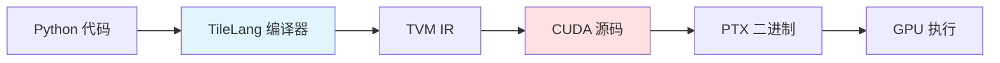
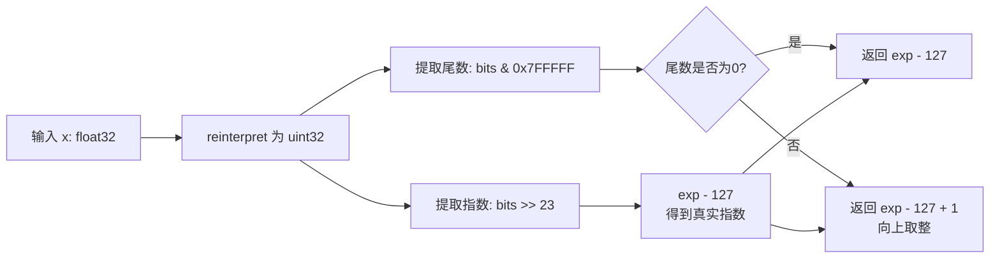
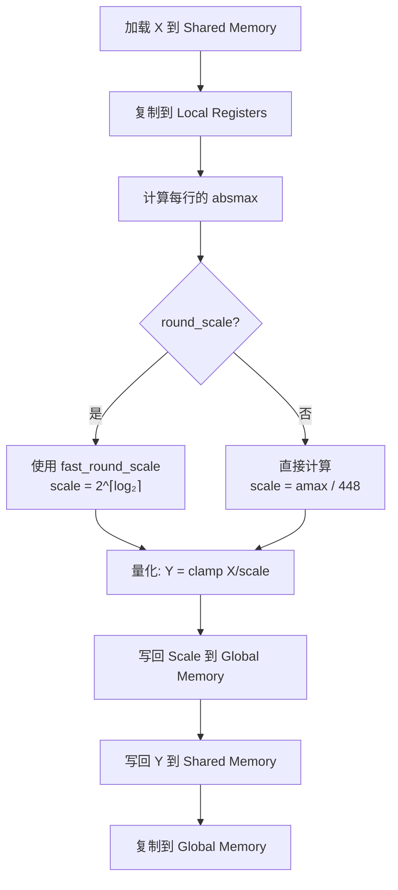
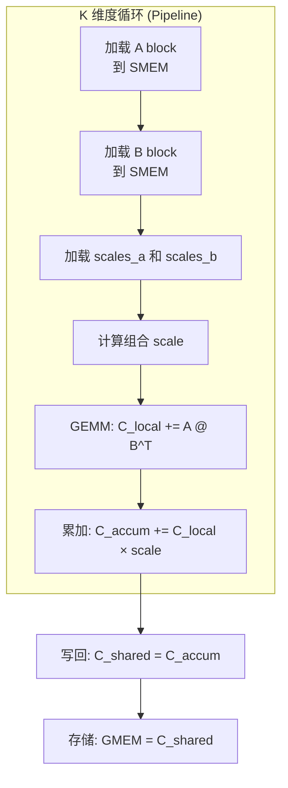

# KERNEL.md - FP8 算子内核详解

## 目录

- [1. 概述](#1-概述)
- [2. TileLang 基础](#2-tilelang-基础)
- [3. FP8 量化原理](#3-fp8-量化原理)
- [4. 快速数学函数](#4-快速数学函数)
- [5. 激活量化内核 (act_quant)](#5-激活量化内核-act_quant)
- [6. FP8 矩阵乘法内核 (fp8_gemm)](#6-fp8-矩阵乘法内核-fp8_gemm)
- [7. DSA Indexer 内核 (fp8_index)](#7-dsa-indexer-内核-fp8_index)

## 1. 概述

`kernel.py` 使用 [TileLang](https://github.com/tile-ai/tilelang) 框架实现了三个核心 FP8 算子：

| 函数 | 功能 | 主要用途 |
|------|------|----------|
| `act_quant_kernel` | 激活值量化 | 将 BF16 激活值量化为 FP8 |
| `fp8_gemm_kernel` | FP8 矩阵乘法 | 计算 $C = A \times B^T$，A 和 B 都是 FP8 |
| `fp8_index_kernel` | DSA Indexer 计算 | 计算稀疏注意力中的 index score |

## 2. TileLang 基础

TileLang 是一个用于编写高效 GPU 内核的 DSL（领域特定语言），基于 TVM。

### 2.1 核心概念



### 2.2 关键语法元素

| 语法 | 含义 | 示例 |
|------|------|------|
| `T.symbolic("M")` | 符号变量，编译时不确定 | `M = T.symbolic("M")` |
| `T.Kernel(...)` | 定义 CUDA kernel | `T.Kernel(grid_x, grid_y, threads=128)` |
| `T.alloc_shared(...)` | 分配共享内存 | `T.alloc_shared((32, 128), "float32")` |
| `T.alloc_fragment(...)` | 分配寄存器片段 | `T.alloc_fragment((32, 128), "float32")` |
| `T.copy(...)` | 内存拷贝 | `T.copy(src, dst)` |
| `T.gemm(...)` | 矩阵乘法 | `T.gemm(A, B, C, transpose_B=True)` |
| `T.Pipelined(...)` | 循环流水线 | `for k in T.Pipelined(K_iters, num_stages=4)` |
| `T.Parallel(...)` | 并行循环 | `for i in T.Parallel(32)` |

### 2.3 传递配置

```python
# kernel.py:L9-L13
pass_configs = {
    tilelang.PassConfigKey.TL_DISABLE_WARP_SPECIALIZED: True,
    tilelang.PassConfigKey.TL_DISABLE_TMA_LOWER: True,
}
```

- `TL_DISABLE_WARP_SPECIALIZED`: 禁用 warp 专用化，保持可读性
- `TL_DISABLE_TMA_LOWER`: 禁用 TMA (Tensor Memory Accelerator) 降低

## 3. FP8 量化原理

### 3.1 FP8 E4M3 格式

FP8 E4M3 是一种 8 位浮点格式：
- **1 位符号位**
- **4 位指数** (exponent)
- **3 位尾数** (mantissa)

$$ \text{value} = (-1)^s \times 2^{e-7} \times (1 + m/8) $$

| 指数 | 尾数 | 表示范围 |
|------|------|----------|
| E4M3 | 4 bits | 1-15 (指数偏移 7) |
| M3 | 3 bits | 0-7 |

**数值范围**：
- 最大值: 448.0
- 最小值: -448.0
- 最小正数: $2^{-6} \times 1 = 0.015625$

### 3.2 块级量化

```python
# kernel.py:L46
group_size = 128  # 每 128 个元素共享一个 scale
```

量化公式：
$$ Y = \text{clamp}\left(\frac{X}{S}, -448, 448\right) $$

反量化公式：
$$ X = Y \times S $$

其中：
- $X$: 原始 BF16 激活值
- $Y$: 量化后的 FP8 值
- $S$: 缩放因子，$S = \max(|X|) / 448$

### 3.3 数据类型定义

```python
# kernel.py:L15-L17
FP8 = "float8_e4m3"   # FP8 E4M3 格式
BF16 = "bfloat16"     # BFloat16 格式
FP32 = "float32"      # Float32 格式（用于 scale）
```

## 4. 快速数学函数

### 4.1 fast_log2_ceil - 快速 $\lceil \log_2(x) \rceil$

**位置**: `kernel.py:L20-L24`

```python
def fast_log2_ceil(x):
    bits_x = T.reinterpret("uint32", x)
    exp_x = (bits_x >> 23) & 0xFF
    man_bits = bits_x & ((1 << 23) - 1)
    return T.Cast("int32", exp_x - 127 + T.if_then_else(man_bits != 0, 1, 0))
```

**原理**：利用 IEEE 754 浮点数的位表示



**数学推导**：
- IEEE 754 单精度浮点数: $x = (-1)^s \times 2^{e-127} \times (1 + m)$
- 其中 $e \in [0, 255]$ 是编码的指数，$m \in [0, 1)$ 是尾数
- $\log_2(x) \approx e - 127 + \mathbb{1}_{m > 0}$

**输入输出**：
- 输入: $x \in \mathbb{R}$ (正数)
- 输出: $\lceil \log_2(x) \rceil \in \mathbb{Z}$

### 4.2 fast_pow2 - 快速 $2^x$

**位置**: `kernel.py:L27-L29`

```python
def fast_pow2(x):
    bits_x = (x + 127) << 23
    return T.reinterpret("float32", bits_x)
```

**原理**：逆向构造 IEEE 754 表示

**数学推导**：
- 要计算 $y = 2^x$
- IEEE 754 编码: $e = x + 127$
- 位表示: $(e \ll 23) \mid 0$ (尾数为 0)

**输入输出**：
- 输入: $x \in \mathbb{Z}$ (整数)
- 输出: $2^x \in \mathbb{R}$

### 4.3 fast_round_scale - 快速舍入缩放

**位置**: `kernel.py:L32-L33`

```python
def fast_round_scale(amax, fp8_max_inv):
    return fast_pow2(fast_log2_ceil(amax * fp8_max_inv))
```

**用途**：将缩放因子舍入到最近的 2 的幂次

**数学公式**：
$$ S = 2^{\lceil \log_2(\text{amax} \times 1/448) \rceil} $$

**为什么用 2 的幂次**：
1. 硬件除法可以用右移替代
2. 加快量化/反量化速度

## 5. 激活量化内核 (act_quant)

### 5.1 act_quant_kernel - 内核定义

**位置**: `kernel.py:L36-L84`

#### 函数签名

```python
@tilelang.jit(pass_configs=pass_configs)
def act_quant_kernel(
    N, in_dtype=BF16, out_dtype=FP8, scale_dtype=FP32, round_scale=False
):
```

**参数**：
- `N`: 序列长度（编译时常量）
- `in_dtype`: 输入数据类型（默认 BF16）
- `out_dtype`: 输出数据类型（默认 FP8）
- `scale_dtype`: 缩放因子数据类型（默认 FP32）
- `round_scale`: 是否将 scale 舍入到 2 的幂次

#### 输入输出张量

```python
@T.prim_func
def act_quant_kernel_(
    X: T.Tensor[(M, N), in_dtype],         # 输入: (M, N)
    Y: T.Tensor[(M, N), out_dtype],        # 输出: (M, N)
    S: T.Tensor[(M, T.ceildiv(N, group_size)), scale_dtype],  # scale: (M, ⌈N/128⌉)
):
```

| 张量 | 形状 | 数据类型 | 说明 |
|------|------|----------|------|
| X | $(M, N)$ | BF16 | 输入激活值 |
| Y | $(M, N)$ | FP8 E4M3 | 量化后的输出 |
| S | $(M, \lceil N/128 \rceil)$ | FP32 | 每 128 个元素的缩放因子 |

#### 内核配置

```python
# kernel.py:L45-L46
blk_m = 32        # 每个 block 处理 32 行
group_size = 128  # 量化组大小
```

#### Kernel 启动配置

```python
# kernel.py:L54
with T.Kernel(T.ceildiv(M, blk_m), T.ceildiv(N, group_size), threads=128) as (
    pid_m,
    pid_n,
):
```

- **Grid 大小**: $(\lceil M/32 \rceil, \lceil N/128 \rceil)$
- **Block 大小**: 128 threads
- **pid_m**: 行 block ID (每个 block 处理 32 行)
- **pid_n**: 列 block ID (每个 block 处理 128 列)

#### 内存分配

```python
# kernel.py:L58-L63
x_shared = T.alloc_shared((blk_m, group_size), in_dtype)          # (32, 128) Shared Memory
x_local = T.alloc_fragment((blk_m, group_size), in_dtype)         # (32, 128) Registers
amax_local = T.alloc_fragment((blk_m,), scale_dtype)              # (32,) Registers
s_local = T.alloc_fragment((blk_m,), scale_dtype)                 # (32,) Registers
y_local = T.alloc_fragment((blk_m, group_size), out_dtype)        # (32, 128) Registers
y_shared = T.alloc_shared((blk_m, group_size), out_dtype)         # (32, 128) Shared Memory
```

**内存分析**：
- Shared Memory: $32 \times 128 \times 2$ (BF16) $+ 32 \times 128 \times 1$ (FP8) $= 12$ KB
- Registers: 约 $32 \times 128 \times 4 = 16$ KB (假设所有寄存器片段都被分配)

#### 计算流程



**代码详解**：

```python
# kernel.py:L65-L82
for _ in T.Pipelined(1, num_stages=num_stages):
    # 1. 加载输入数据
    T.copy(X[pid_m * blk_m, pid_n * group_size], x_shared)  # GMEM → SMEM
    T.copy(x_shared, x_local)                               # SMEM → REGS

    # 2. 计算每行的绝对值最大值
    T.reduce_absmax(x_local, amax_local, dim=1)  # 沿列维度 reduce

    # 3. 计算缩放因子
    for i in T.Parallel(blk_m):
        amax_local[i] = T.max(amax_local[i], 1e-4)  # 防止除零
        if round_scale:
            s_local[i] = fast_round_scale(amax_local[i], fp8_max_inv)
        else:
            s_local[i] = amax_local[i] * fp8_max_inv  # fp8_max_inv = 1/448

    # 4. 量化
    for i, j in T.Parallel(blk_m, group_size):
        y_local[i, j] = T.clamp(
            x_local[i, j] / s_local[i], fp8_min, fp8_max
        )

    # 5. 写回结果
    for i in T.Parallel(blk_m):
        S[pid_m * blk_m + i, pid_n] = s_local[i]  # 写 scale
    T.copy(y_local, y_shared)                       # REGS → SMEM
    T.copy(y_shared, Y[pid_m * blk_m, pid_n * group_size])  # SMEM → GMEM
```

#### Pipeline Stages

```python
# kernel.py:L44
num_stages = 0 if round_scale else 2
```

- `round_scale=False`: 2 stages（隐藏内存延迟）
- `round_scale=True`: 0 stages（快速数学函数依赖导致无法流水线）

### 5.2 act_quant - Python 封装

**位置**: `kernel.py:L87-L111`

```python
def act_quant(
    x: torch.Tensor, block_size: int = 128, scale_fmt: Optional[str] = None
) -> Tuple[torch.Tensor, torch.Tensor]:
```

**输入输出**：
- 输入: $x \in \mathbb{R}^{B \times S \times D}$ (连续内存)
- 输出:
  - $y \in \mathbb{R}^{B \times S \times D}$ (FP8)
  - $s \in \mathbb{R}^{B \times S \times \lceil D/128 \rceil}$ (FP32 scale)

**张量形状变化**：

| 阶段 | 形状 | 说明 |
|------|------|------|
| 输入 x | $(B, S, D)$ | 例如 $(1, 100, 2048)$ |
| 展平后 | $(B \times S, D)$ | $(100, 2048)$ |
| 输出 y | $(B \times S, D)$ | $(100, 2048)$ FP8 |
| 输出 s | $(B \times S, \lceil D/128 \rceil)$ | $(100, 16)$ FP32 |

**调用示例**：
```python
# 在 model.py:L500 中使用
q_fp8, q_scale = act_quant(q, block_size, self.scale_fmt)
# q: (bsz, seqlen, 64 * 128) = (1, 1, 8192)
# q_fp8: (1, 8192) FP8
# q_scale: (1, 64) FP32
```

## 6. FP8 矩阵乘法内核 (fp8_gemm)

### 6.1 fp8_gemm_kernel - 内核定义

**位置**: `kernel.py:L114-L168`

#### 函数签名

```python
@tilelang.jit(pass_configs=pass_configs)
def fp8_gemm_kernel(N, K, out_dtype=BF16, accum_dtype="float32"):
```

**参数**：
- `N`: 输出矩阵的列数（B 的行数）
- `K`: 矩阵乘法的归约维度
- `out_dtype`: 输出数据类型（BF16 或 FP32）
- `accum_dtype`: 累加器数据类型（FP32）

#### 输入输出张量

```python
@T.prim_func
def fp8_gemm_kernel_(
    A: T.Tensor[(M, K), FP8],                          # 输入 A: (M, K)
    B: T.Tensor[(N, K), FP8],                          # 输入 B: (N, K), 转置使用
    C: T.Tensor[(M, N), out_dtype],                    # 输出 C: (M, N)
    scales_a: T.Tensor[(M, T.ceildiv(K, group_size)), FP32],  # A 的 scale
    scales_b: T.Tensor[(T.ceildiv(N, group_size), T.ceildiv(K, group_size)), FP32],  # B 的 scale
):
```

| 张量 | 形状 | 数据类型 | 说明 |
|------|------|----------|------|
| A | $(M, K)$ | FP8 | 输入矩阵 1 |
| B | $(N, K)$ | FP8 | 输入矩阵 2（转置） |
| C | $(M, N)$ | BF16/FP32 | 输出矩阵 |
| scales_a | $(M, \lceil K/128 \rceil)$ | FP32 | A 的块级 scale |
| scales_b | $(\lceil N/128 \rceil, \lceil K/128 \rceil)$ | FP32 | B 的块级 scale |

#### 矩阵乘法公式

$$ C_{ij} = \sum_{k} \text{dequant}(A_{ik}, s_a) \times \text{dequant}(B_{jk}, s_b) $$

可以重写为：
$$ C_{ij} = \sum_{k} (A_{ik} \times s_a^{(row)} \times s_b^{(col)}) \times B_{jk} $$

其中 $s_a^{(row)}$ 和 $s_b^{(col)}$ 是对应块的缩放因子。

#### Block 配置

```python
# kernel.py:L119-L122
group_size = 128
block_M = 32
block_N = 128
block_K = 128
```

#### Kernel 启动配置

```python
# kernel.py:L132-L135
with T.Kernel(T.ceildiv(N, block_N), T.ceildiv(M, block_M), threads=128) as (
    bx,
    by,
):
```

- **Grid 大小**: $(\lceil N/128 \rceil, \lceil M/32 \rceil)$
- **Block 大小**: 128 threads

#### 内存分配

```python
# kernel.py:L136-L141
A_shared = T.alloc_shared((block_M, block_K), FP8)        # (32, 128) SMEM
B_shared = T.alloc_shared((block_N, block_K), FP8)        # (128, 128) SMEM
C_shared = T.alloc_shared((block_M, block_N), out_dtype)  # (32, 128) SMEM
Scale_C_shared = T.alloc_shared((block_M), FP32)          # (32,) SMEM
C_local = T.alloc_fragment((block_M, block_N), accum_dtype)        # (32, 128) REGS
C_local_accum = T.alloc_fragment((block_M, block_N), accum_dtype)  # (32, 128) REGS
```

**内存分析**：
- Shared Memory: $32 \times 128 \times 1 + 128 \times 128 \times 1 + 32 \times 128 \times 2 = 24.5$ KB
- Registers: $32 \times 128 \times 4 \times 2 = 32$ KB

#### 计算流程



**代码详解**：

```python
# kernel.py:L143-L166
# 改善 L2 Cache
T.use_swizzle(panel_size=10)

T.clear(C_local)
T.clear(C_local_accum)
K_iters = T.ceildiv(K, block_K)

for k in T.Pipelined(K_iters, num_stages=4):
    # 1. 加载 A 和 B 到共享内存
    T.copy(A[by * block_M, k * block_K], A_shared)  # 加载 A 的一个 block
    T.copy(B[bx * block_N, k * block_K], B_shared)  # 加载 B 的一个 block

    # 2. 加载并计算缩放因子
    Scale_B = scales_b[bx * block_N // group_size, k]
    for i in T.Parallel(block_M):
        Scale_C_shared[i] = scales_a[by * block_M + i, k] * Scale_B

    # 3. 矩阵乘法 (FP8)
    T.gemm(A_shared, B_shared, C_local, transpose_B=True)

    # 4. 累加到 FP32 (应用缩放)
    for i, j in T.Parallel(block_M, block_N):
        C_local_accum[i, j] += C_local[i, j] * Scale_C_shared[i]
    T.clear(C_local)

# 5. 写回结果
T.copy(C_local_accum, C_shared)
T.copy(C_shared, C[by * block_M, bx * block_N])
```

**关键优化**：
1. **Swizzle**: `T.use_swizzle(panel_size=10)` - 改善 L2 Cache 访问模式
2. **4-Stage Pipeline**: 隐藏内存延迟
3. **双累加器**: `C_local` (FP8 GEMM 结果) 和 `C_local_accum` (FP32 累加)
4. **Scale 融合**: 在累加时直接乘以缩放因子

### 6.2 fp8_gemm - Python 封装

**位置**: `kernel.py:L171-L196`

```python
def fp8_gemm(
    a: torch.Tensor, a_s: torch.Tensor, b: torch.Tensor, b_s: torch.Tensor
) -> torch.Tensor:
```

**输入输出**：
- 输入:
  - $a \in \mathbb{R}^{M \times K}$ (FP8, 连续)
  - $a_s \in \mathbb{R}^{M \times \lceil K/128 \rceil}$ (FP32, 连续)
  - $b \in \mathbb{R}^{N \times K}$ (FP8, 连续)
  - $b_s \in \mathbb{R}^{\lceil N/128 \rceil \times \lceil K/128 \rceil}$ (FP32, 连续)
- 输出: $c \in \mathbb{R}^{M \times N}$ (BF16)

**形状变换示例**：
```python
# 在 model.py:L163 中使用
x, scale = act_quant(x, block_size, scale_fmt)
return fp8_gemm(x, scale, weight, weight.scale)

# 假设:
# x: (32, 2048) BF16 → (32, 2048) FP8 + (32, 16) FP32 scale
# weight: (4096, 2048) FP8 + (32, 16) FP32 scale
# 输出: (32, 4096) BF16
```

## 7. DSA Indexer 内核 (fp8_index)

### 7.1 fp8_index_kernel - 内核定义

**位置**: `kernel.py:L199-L251`

#### 函数签名

```python
@tilelang.jit(out_idx=[4], pass_configs=pass_configs)
def fp8_index_kernel(h: int, d: int):
```

**参数**：
- `h`: Indexer head 数量
- `d`: Head 维度

#### 输入输出张量

```python
@T.prim_func
def fp8_index_kernel_(
    q: T.Tensor[(b, m, h, d), FP8],                          # Query: (batch, seq_q, heads, dim)
    q_s: T.Tensor[(b, m, h), FP32],                          # Query scale: (batch, seq_q, heads)
    k: T.Tensor[(b, n, d), FP8],                             # Key: (batch, seq_k, dim)
    k_s: T.Tensor[(b, n), FP32],                             # Key scale: (batch, seq_k)
    o: T.Tensor[(b, m, n), FP32],                            # Output: (batch, seq_q, seq_k)
) -> None:
```

| 张量 | 形状 | 数据类型 | 说明 |
|------|------|----------|------|
| q | $(b, m, h, d)$ | FP8 | Query，h=64, d=128 |
| q_s | $(b, m, h)$ | FP32 | Query 的 per-head scale |
| k | $(b, n, d)$ | FP8 | Key |
| k_s | $(b, n)$ | FP32 | Key 的 scale (E8M0, 指数量化) |
| o | $(b, m, n)$ | FP32 | Index score (logits) |

**out_idx=[4]** 的含义：输出是第 5 个参数（索引从 0 开始），即 `o`。

#### Index Score 计算公式

$$ \text{index\_score}[i, j] = \text{ReLU}\left(\frac{\sum_{head} (q_{ij}^{head} \cdot k_j)}{\text{scale}_q^{head} \cdot \text{scale}_k}\right) \times \text{scale}_q^{head} \times \text{scale}_k $$

简化为：
$$ \text{index\_score}[i, j] = \text{ReLU}(\text{FP8GEMM}(q, k^T)) \times \text{weights} $$

#### Block 配置

```python
# kernel.py:L205-L206
blk_n1 = 512   # 外层循环：每次处理 512 个 key
blk_n2 = 128   # 内层循环：每次处理 128 个 key
```

#### Kernel 启动配置

```python
# kernel.py:L216
with T.Kernel(b, m, T.ceildiv(n, blk_n1)) as (i_b, i_m, i1_n):
```

- **Grid 大小**: $(b, m, \lceil n/512 \rceil)$
- 每个线程块处理一个 batch、一个 query 位置、512 个 key 位置

#### 内存分配

```python
# kernel.py:L217-L230
q_smem = T.alloc_shared((h, d), FP8)                    # (64, 128) SMEM
q_s_frag = T.alloc_fragment(h, FP32)                    # (64,) REGS
k_smem = T.alloc_shared((blk_n2, d), FP8)               # (128, 128) SMEM
k_s_frag = T.alloc_fragment(blk_n2, FP32)               # (128,) REGS
logits = T.alloc_fragment((blk_n2, h), FP32)            # (128, 64) REGS
logits_sum = T.alloc_fragment(blk_n2, FP32)             # (128,) REGS
```

**内存分析**：
- Shared Memory: $64 \times 128 \times 1 + 128 \times 128 \times 1 = 24.6$ KB
- Registers: $64 + 128 + 128 \times 64 \times 4 + 128 \times 4 \approx 33$ KB

#### 计算流程

```mermaid
flowchart TD
    A[加载 q 到 SMEM<br/>一次全部加载] --> B[加载 q_s 到 REGS<br/>per-head scale]

    B --> C{n 循环<br/>每次 128 个 key}
    C --> D[加载 k block 到 SMEM<br/>(128, 128)]
    D --> E[加载 k_s 到 REGS<br/>(128,)]
    E --> F[GEMM: logits = k @ q^T<br/>(128, 64)]
    F --> G[ReLU + × scale<br/>logits = max × q_s]
    G --> H[Reduce sum<br/>沿 head 维度]
    H --> I[× k_s<br/>E8M0 量化]
    I --> J[写回输出<br/>o[:, :, idx]]
    J --> C
```

**代码详解**：

```python
# kernel.py:L217-L249
with T.Kernel(b, m, T.ceildiv(n, blk_n1)) as (i_b, i_m, i1_n):
    # 1. 加载 Query (整个 head 维度一次性加载)
    q_smem = T.alloc_shared((h, d), FP8)
    T.copy(q[i_b, i_m, 0, 0], q_smem)  # 加载所有 h × d

    q_s_frag = T.alloc_fragment(h, FP32)
    T.copy(q_s[i_b, i_m, 0], q_s_frag)  # 加载 per-head scale

    # 2. 循环处理 Key (每次 128 个)
    for i2_n in T.Pipelined(blk_n1 // blk_n2, num_stages=2):
        k_smem = T.alloc_shared((blk_n2, d), FP8)
        T.copy(k[i_b, i1_n * blk_n1 + i2_n * blk_n2, 0], k_smem)

        k_s_frag = T.alloc_fragment(blk_n2, FP32)
        T.copy(k_s[i_b, i1_n * blk_n1 + i2_n * blk_n2], k_s_frag)

        # 3. 计算 logits: (128, 128) @ (128, 64) → (128, 64)
        logits = T.alloc_fragment((blk_n2, h), FP32)
        T.gemm(
            k_smem,
            q_smem,
            logits,
            transpose_A=False,
            transpose_B=True,
            clear_accum=True,
        )

        # 4. ReLU + per-head scaling
        for i_h, i3_n in T.Parallel(h, blk_n2):
            logits[i3_n, i_h] = T.max(logits[i3_n, i_h], 0) * q_s_frag[i_h]

        # 5. Reduce sum (沿 head 维度)
        logits_sum = T.alloc_fragment(blk_n2, FP32)
        T.reduce_sum(logits, logits_sum, dim=1)

        # 6. 应用 Key scale (E8M0)
        for i3_n in T.Parallel(blk_n2):
            logits_sum[i3_n] *= k_s_frag[i3_n]

        # 7. 写回结果
        T.copy(logits_sum, o[i_b, i_m, i1_n * blk_n1 + i2_n * blk_n2])
```

**关键点**：
1. **Query 复用**: 整个 $m$ 循环中，Query 只加载一次
2. **Key 分块**: 每 128 个 Key 一个 block，减少内存占用
3. **Head 维度 Reduce**: 在每个 block 内部完成 head 维度的求和
4. **E8M0 Key Scale**: Key scale 是指数形式的量化，直接相乘

### 7.2 fp8_index - Python 封装

**位置**: `kernel.py:L254-L274`

```python
def fp8_index(
    q: torch.Tensor,
    q_s: torch.Tensor,
    k: torch.Tensor,
    k_s: torch.Tensor,
) -> torch.Tensor:
```

**输入输出**：
- 输入:
  - $q \in \mathbb{R}^{B \times M \times H \times D}$ (FP8)
  - $q_s \in \mathbb{R}^{B \times M \times H}$ (FP32)
  - $k \in \mathbb{R}^{B \times N \times D}$ (FP8)
  - $k_s \in \mathbb{R}^{B \times N}$ (FP32)
- 输出: $o \in \mathbb{R}^{B \times M \times N}$ (FP32)

**调用示例**：
```python
# 在 model.py:L516 中使用
index_score = fp8_index(q_fp8.contiguous(), weights.contiguous(), k, k_s)

# 实际形状 (bsz=1, seqlen=1):
# q_fp8: (1, 1, 8192) → view_as (1, 1, 64, 128)
# weights: (1, 1, 64) → view_as (1, 64)
# k: (1, end_pos, 128)
# k_s: (1, end_pos)
# 输出: (1, 1, end_pos)
```

## 8. 性能总结

### 8.1 计算复杂度

| 内核 | 操作 | 复杂度 | 说明 |
|------|------|--------|------|
| act_quant | 量化 | $O(M \times N)$ | 每元素一次 clamp |
| fp8_gemm | 矩阵乘法 | $O(M \times N \times K)$ | 标准 GEMM |
| fp8_index | Index Score | $O(B \times M \times N \times H \times D)$ | 稀疏注意力 |

### 8.2 内存带宽

假设 FP16/BF16 = 2 bytes, FP8 = 1 byte:

| 内核 | 读取 (bytes) | 写入 (bytes) | 计算强度 |
|------|-------------|-------------|---------|
| act_quant | $M \times N \times 2$ | $M \times N \times 1 + M \times \lceil N/128 \rceil \times 4$ | 低 |
| fp8_gemm | $M \times K \times 1 + N \times K \times 1$ | $M \times N \times 2$ | 高 |
| fp8_index | $M \times H \times D \times 1 + N \times D \times 1$ | $M \times N \times 4$ | 中 |

### 8.3 Shared Memory 使用

| 内核 | SMEM 大小 | 配置 |
|------|----------|------|
| act_quant | 12 KB | 32 × 128 × (2+1) |
| fp8_gemm | 24.5 KB | 32×128×1 + 128×128×1 + 32×128×2 |
| fp8_index | 24.6 KB | 64×128×1 + 128×128×1 |

**注意**: 所有内核都远低于 48 KB 的 SMEM 限制（A100）。

---

**下一步**: 阅读 [MODEL_LINEAR.md](MODEL_LINEAR.md) 了解如何使用这些内核。
