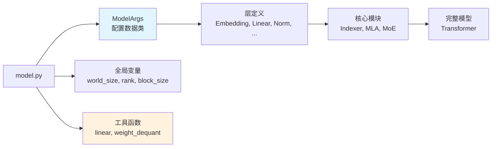
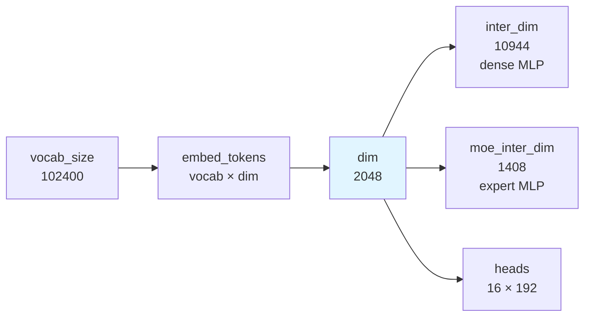
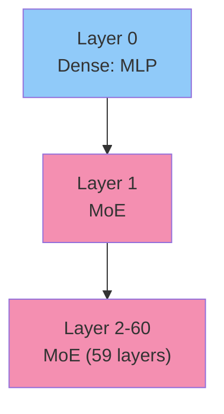
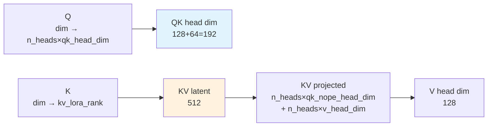
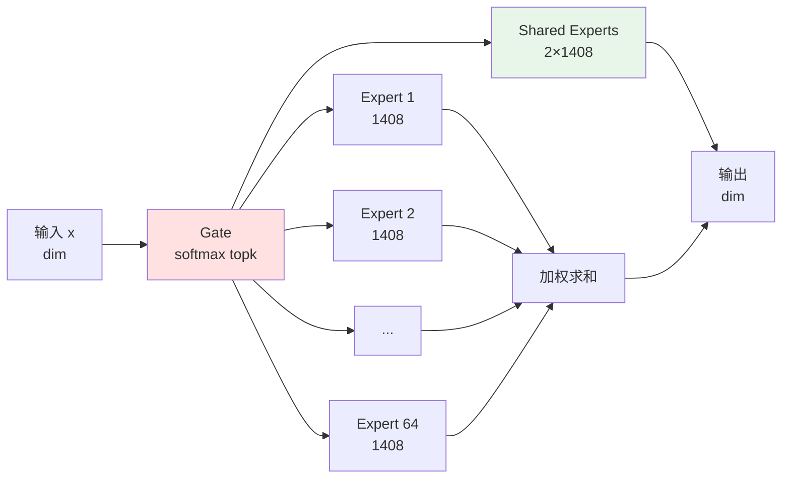
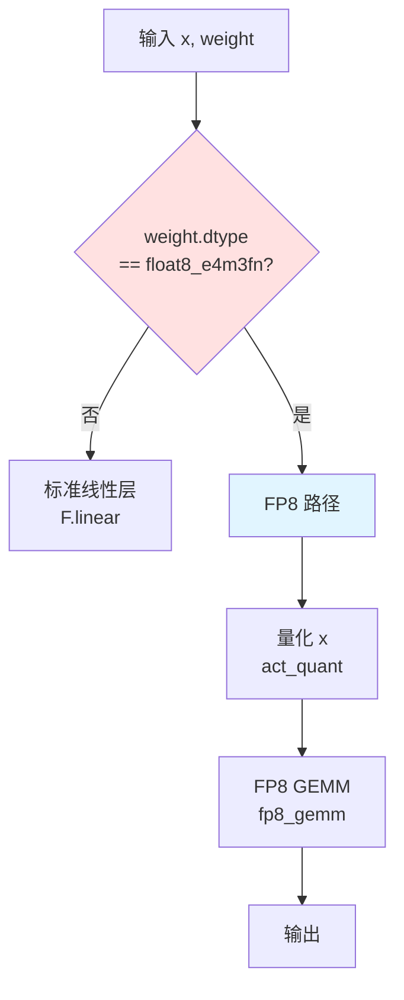

# MODEL_BASE.md - 模型基础配置与工具

## 目录

- [1. 概述](#1-概述)
- [2. 导入与全局变量](#2-导入与全局变量)
- [3. ModelArgs 数据类](#3-modelargs-数据类)
- [4. 工具函数](#4-工具函数)
- [5. 参数说明](#5-参数说明)

## 1. 概述

`model.py` 是 DeepSeek-V3.2-Exp 推理模型的核心定义文件。本文档介绍模型的基础配置和工具函数。



## 2. 导入与全局变量

### 2.1 导入语句

**位置**: `model.py:L1-L11`

```python
import math
from dataclasses import dataclass
from typing import Tuple, Optional, Literal

import torch
from torch import nn
import torch.nn.functional as F
import torch.distributed as dist

from kernel import act_quant, fp8_gemm, fp8_index
import trace as ds_trace
```

**导入说明**：
| 模块 | 用途 |
|------|------|
| `math` | 数学常量和函数（用于 RoPE 计算） |
| `dataclasses` | `ModelArgs` 数据类定义 |
| `typing` | 类型注解 |
| `torch` | PyTorch 核心功能 |
| `torch.distributed` | 分布式训练支持 |
| `kernel` | 自定义 FP8 算子 |
| `trace` | DSA trace 插桩系统 |

### 2.2 全局变量

**位置**: `model.py:L14-L16`

```python
world_size = 1
rank = 0
block_size = 128
```

| 变量 | 默认值 | 说明 |
|------|--------|------|
| `world_size` | 1 | 分布式训练的 GPU 总数 |
| `rank` | 0 | 当前 GPU 的 rank（0 ~ world_size-1） |
| `block_size` | 128 | FP8 量化的块大小（用于计算 scale 数量） |

**注意**: 这些值在 `Transformer.__init__` 中会被重新赋值：

```python
# model.py:L926-L928
global world_size, rank
world_size = dist.get_world_size() if dist.is_initialized() else 1
rank = dist.get_rank() if dist.is_initialized() else 0
```

## 3. ModelArgs 数据类

### 3.1 完整定义

**位置**: `model.py:L18-L92`

```python
@dataclass
class ModelArgs:
    """模型参数配置数据类"""
    # 基础配置
    max_batch_size: int = 8          # 最大批大小
    max_seq_len: int = 4096 * 4      # 最大序列长度 (16384)
    dtype: Literal["bf16", "fp8"] = "bf16"  # 数据类型
    scale_fmt: Optional[str] = None  # 量化 scale 格式

    # 词汇表与维度
    vocab_size: int = 102400         # 词汇表大小
    dim: int = 2048                  # 模型隐藏维度

    # MLP 配置
    inter_dim: int = 10944           # MLP 中间维度
    moe_inter_dim: int = 1408        # MoE 专家中间维度

    # 层数配置
    n_layers: int = 27               # 总层数
    n_dense_layers: int = 1          # 密集层数（前 N 层使用 MLP 而非 MoE）

    # 注意力配置
    n_heads: int = 16                # 注意力头数

    # MoE 配置
    n_routed_experts: int = 64       # 路由专家总数
    n_shared_experts: int = 2        # 共享专家数
    n_activated_experts: int = 6     # 每次激活的专家数
    n_expert_groups: int = 1         # 专家组数
    n_limited_groups: int = 1        # 限制组数
    score_func: Literal["softmax", "sigmoid"] = "softmax"  # 路由评分函数
    route_scale: float = 1.          # 路由缩放因子

    # MLA (Multi-Head Latent Attention) 配置
    q_lora_rank: int = 0             # Query LoRA 秩
    kv_lora_rank: int = 512          # KV 压缩秩
    qk_nope_head_dim: int = 128      # QK 非 RoPE 头维度
    qk_rope_head_dim: int = 64       # QK RoPE 头维度
    v_head_dim: int = 128            # Value 头维度

    # YaRN (RoPE 扩展) 配置
    original_seq_len: int = 4096     # 原始序列长度
    rope_theta: float = 10000.0      # RoPE 基频
    rope_factor: float = 40          # YaRN 扩展因子
    beta_fast: int = 32              # 快速 Beta 修正
    beta_slow: int = 1               # 慢速 Beta 修正
    mscale: float = 1.               # 多尺度缩放

    # DSA Indexer 配置
    index_n_heads: int = 64          # Indexer 头数
    index_head_dim: int = 128        # Indexer 头维度
    index_topk: int = 2048           # Top-K 选择数量
```

### 3.2 参数分组详解

#### 3.2.1 基础配置

| 参数 | 类型 | 默认值 | 说明 |
|------|------|--------|------|
| `max_batch_size` | int | 8 | KV cache 预分配的批大小 |
| `max_seq_len` | int | 16384 | KV cache 预分配的序列长度 |
| `dtype` | str | "bf16" | 权重数据类型："bf16" 或 "fp8" |
| `scale_fmt` | str | None | 量化 scale 格式（可选） |

**重要**: `max_batch_size` 和 `max_seq_len` **不是**运行时的实际值，而是**预分配上限**。

#### 3.2.2 模型维度



| 参数 | 值 | 说明 |
|------|-----|------|
| `vocab_size` | 102400 | 词汇表大小 |
| `dim` | 2048 | 隐藏层维度 |
| `inter_dim` | 10944 | Dense MLP 中间维度 |
| `moe_inter_dim` | 1408 | MoE 专家中间维度 |

#### 3.2.3 层数配置



| 参数 | 值 | 说明 |
|------|-----|------|
| `n_layers` | 27 | 总层数 |
| `n_dense_layers` | 1 | 密集层数（仅 Layer 0） |
| MoE 层数 | 26 | Layer 1-26 使用 MoE |

#### 3.2.4 注意力配置



| 参数 | 值 | 说明 |
|------|-----|------|
| `n_heads` | 16 | 注意力头数 |
| `q_lora_rank` | 0 | Query LoRA 秩（0 表示不压缩） |
| `kv_lora_rank` | 512 | KV 压缩秩 |
| `qk_nope_head_dim` | 128 | QK 非 RoPE 头维度 |
| `qk_rope_head_dim` | 64 | QK RoPE 头维度 |
| `v_head_dim` | 128 | Value 头维度 |

**总 QK 头维度**: `qk_nope_head_dim + qk_rope_head_dim = 128 + 64 = 192`

#### 3.2.5 MoE 配置



| 参数 | 值 | 说明 |
|------|-----|------|
| `n_routed_experts` | 64 | 路由专家总数 |
| `n_shared_experts` | 2 | 共享专家数（总是被激活） |
| `n_activated_experts` | 6 | 每个激活的专家数 |
| `n_expert_groups` | 1 | 专家组数（用于分组路由） |
| `n_limited_groups` | 1 | 限制组数 |
| `score_func` | "softmax" | 路由评分函数 |
| `route_scale` | 1.0 | 路由缩放因子 |

#### 3.2.6 YaRN (RoPE 扩展) 配置

| 参数 | 值 | 说明 |
|------|-----|------|
| `original_seq_len` | 4096 | 原始训练序列长度 |
| `rope_theta` | 10000.0 | RoPE 基频 ($\theta$) |
| `rope_factor` | 40 | YaRN 扩展因子 |
| `beta_fast` | 32 | 快速 Beta 修正（高频） |
| `beta_slow` | 1 | 慢速 Beta 修正（低频） |
| `mscale` | 1.0 | 多尺度缩放因子 |

**扩展后的序列长度**: $4096 \times 40 = 163840$

#### 3.2.7 DSA Indexer 配置

| 参数 | 值 | 说明 |
|------|-----|------|
| `index_n_heads` | 64 | Indexer 头数（远大于主注意力的 16） |
| `index_head_dim` | 128 | Indexer 头维度 |
| `index_topk` | 2048 | Top-K 选择的 token 数 |

### 3.3 配置文件示例

**位置**: `inference/config_671B_v3.2.json`

```json
{
  "max_batch_size": 1,
  "max_seq_len": 16384,
  "dtype": "bf16",
  "vocab_size": 102400,
  "dim": 7168,
  "inter_dim": 18432,
  "moe_inter_dim": 1536,
  "n_layers": 61,
  "n_dense_layers": 1,
  "n_heads": 64,
  "n_routed_experts": 256,
  "n_shared_experts": 2,
  "n_activated_experts": 8,
  "kv_lora_rank": 512,
  "qk_nope_head_dim": 128,
  "qk_rope_head_dim": 64,
  "v_head_dim": 128,
  "rope_factor": 40,
  "index_n_heads": 128,
  "index_head_dim": 128,
  "index_topk": 2048
}
```

## 4. 工具函数

### 4.1 linear - 通用线性层函数

**位置**: `model.py:L135-L164`

```python
def linear(x: torch.Tensor, weight: torch.Tensor, bias: Optional[torch.Tensor] = None,
           scale_fmt: Optional[str] = None) -> torch.Tensor:
```

#### 函数签名

| 参数 | 类型 | 说明 |
|------|------|------|
| `x` | Tensor | 输入张量 |
| `weight` | Tensor | 权重张量（可能已量化） |
| `bias` | Tensor | None | 偏置（当前不支持） |
| `scale_fmt` | str | None | 量化格式 |

#### 计算流程



#### 代码详解

```python
# model.py:L158-L164
assert bias is None  # 当前不支持偏置

if weight.dtype != torch.float8_e4m3fn:
    # 标准 PyTorch 线性层
    return F.linear(x, weight)
else:
    # FP8 量化路径
    x, scale = act_quant(x, block_size, scale_fmt)  # 量化激活值
    return fp8_gemm(x, scale, weight, weight.scale)  # FP8 矩阵乘法
```

#### 张量形状

假设输入 $x \in \mathbb{R}^{M \times K}$，权重 $W \in \mathbb{R}^{N \times K}$：

| 变量 | 形状 | 数据类型 |
|------|------|----------|
| 输入 x | $(M, K)$ | BF16 |
| weight | $(N, K)$ | FP8 |
| weight.scale | $(\lceil N/128 \rceil, \lceil K/128 \rceil)$ | FP32 |
| x (量化后) | $(M, K)$ | FP8 |
| x.scale | $(M, \lceil K/128 \rceil)$ | FP32 |
| 输出 | $(M, N)$ | BF16 |

### 4.2 weight_dequant - 权重反量化

**位置**: `model.py:L541-L546`

```python
def weight_dequant(weight, scale):
    shape = weight.shape
    assert weight.dim() == 2
    weight = weight.view(shape[0] // block_size, block_size,
                         shape[1] // block_size, block_size)
    weight = weight.transpose(1, 2).contiguous()
    weight = weight.view(-1, block_size * block_size)
    weight = (weight.float() * scale.view(-1, 1).float()).to(torch.get_default_dtype())
    weight = weight.view(shape[0] // block_size, shape[1] // block_size,
                         block_size, block_size)
    weight = weight.transpose(1, 2).contiguous().view(shape)
    return weight
```

#### 函数功能

将块级量化的权重反量化为 BF16/FP16。

#### 块级量化格式

```
原始权重: (out_features, in_features)
块级量化后:
  - weight: (out_features, in_features) FP8
  - scale: (⌈out/128⌉, ⌈in/128⌉) FP32

每个 128×128 的块共享一个 scale。
```

#### 计算流程

```mermaid
flowchart TD
    A[weight: O×I<br/>scale: ⌈O/128⌉×⌈I/128⌉] --> B[reshape:<br/>(⌈O/128⌉, 128, ⌈I/128⌉, 128)]
    B --> C[transpose 1,2:<br/>(⌈O/128⌉, ⌈I/128⌉, 128, 128)]
    C --> D[view:<br/>(⌈O×I/128²⌉, 128×128)]
    D --> E[反量化:<br/>× scale.view(-1, 1)]
    E --> F[reshape 回原始形状]

    style C fill:#ffe1e1
    style E fill:#e8f5e9
```

#### 张量形状变化

假设权重为 $(4096, 2048)$：

| 阶段 | 形状 | 说明 |
|------|------|------|
| 原始 | $(4096, 2048)$ | FP8 |
| view 1 | $(32, 128, 16, 128)$ | 按 block 分组 |
| transpose | $(32, 16, 128, 128)$ | 交换 block 维度 |
| view 2 | $(512, 16384)$ | 展平内层 |
| 反量化后 | $(512, 16384)$ | FP32 |
| view 3 | $(32, 16, 128, 128)$ | 恢复 block 结构 |
| transpose | $(32, 128, 16, 128)$ | 恢复原始布局 |
| 最终 | $(4096, 2048)$ | FP32/BF16 |

## 5. 参数说明

### 5.1 数据类型

| 类型 | 存储大小 | 用途 |
|------|----------|------|
| BF16 | 2 bytes | 主要权重和激活值 |
| FP8 E4M3 | 1 byte | 量化后的权重 |
| FP32 | 4 bytes | 量化 scale、累加器 |

### 5.2 维度计算公式

| 变量 | 计算公式 | 示例 (671B) |
|------|----------|-------------|
| KV Cache 大小 | $B \times S \times d_{kv}$ | $1 \times 16384 \times 512 = 8$ MB |
| Q_K 总维度 | $n_h \times (d_{nope} + d_{rope})$ | $64 \times (128 + 64) = 12288$ |
| 每 layer 参数量 (dense) | $\approx d \times 4 \times inter$ | $\approx 7168 \times 4 \times 18432 \approx 1$ B |
| 每 layer 参数量 (MoE) | $\approx n_{exp} \times d \times 2 \times inter$ | $\approx 256 \times 7168 \times 2 \times 1536 \approx 5.6$ B |

### 5.3 内存估算

**671B 模型的单卡内存需求**（8 卡 tensor parallelism）：

| 组件 | 大小 | 说明 |
|------|------|------|
| 权重 (1/8) | ~85 GB | FP16/BF16 格式 |
| KV Cache (max) | ~8 GB | bsz=1, seq=16384 |
| 激活值 | ~10 GB | 估算 |
| 总计 | ~103 GB | 需要 A100 80GB × 2 或 H200 |

---

**下一步**: 阅读 [MODEL_LINEAR.md](MODEL_LINEAR.md) 了解线性层和嵌入层的实现。
