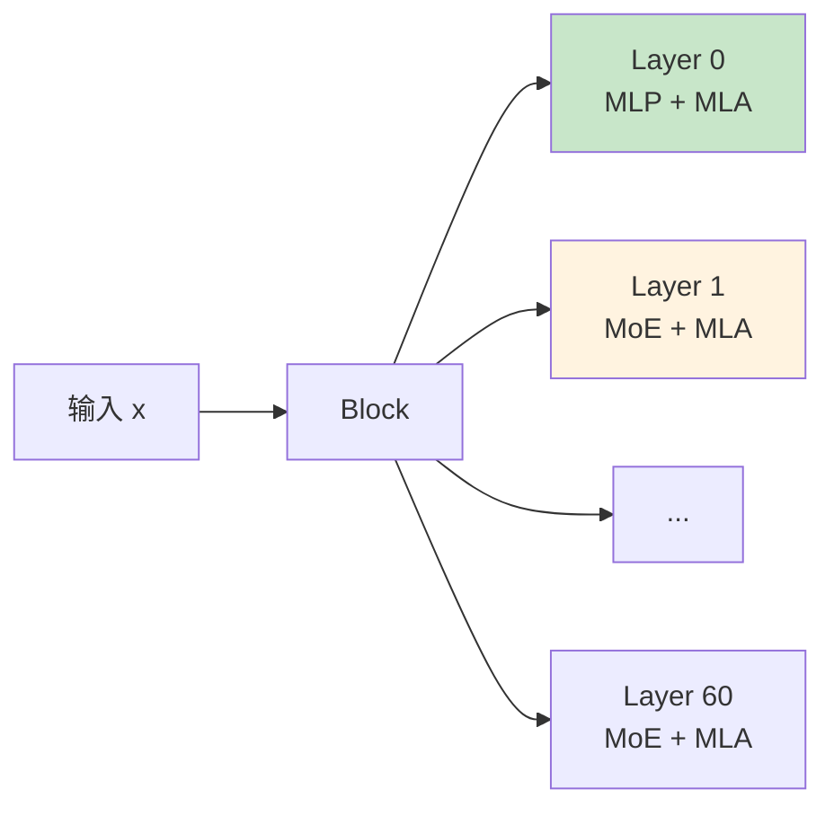
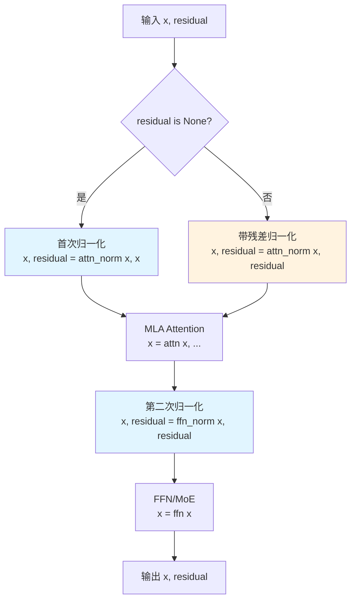
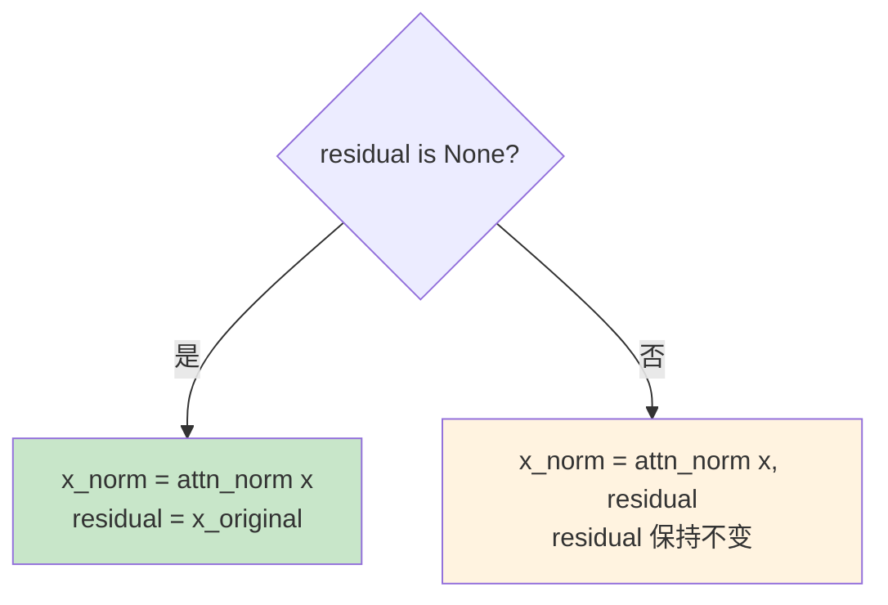
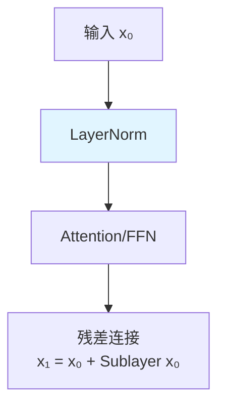
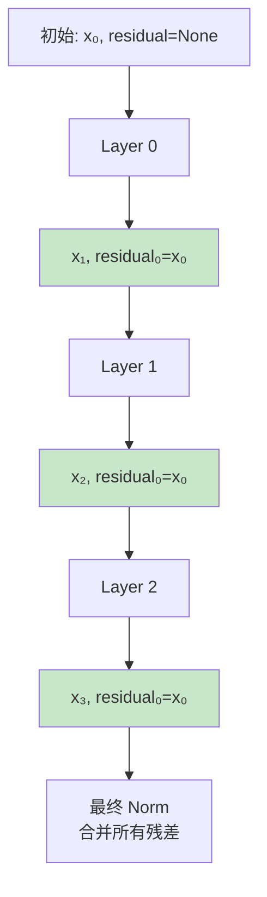
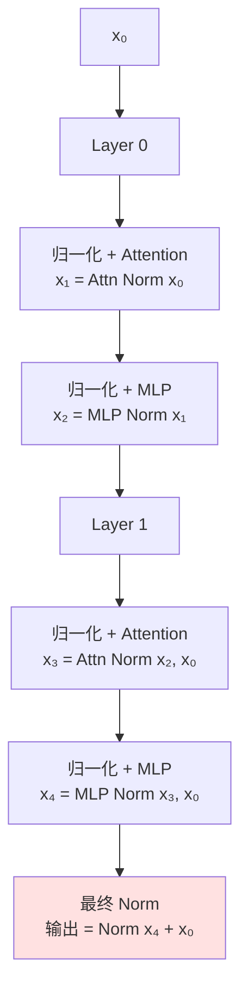

# MODEL_BLOCK.md - Transformer Block 详解

## 目录

- [1. 概述](#1-概述)
- [2. Block 类定义](#2-block-类定义)
- [3. forward 方法详解](#3-forward-方法详解)
- [4. 残差连接与 Pre-Norm](#4-残差连接与-pre-norm)

## 1. 概述

**Block** 是 Transformer 的基本构建单元，包含：
1. **MLA** (Multi-Head Latent Attention) - 注意力机制
2. **FFN** (Feed-Forward Network) - 前馈网络（MLP 或 MoE）



## 2. Block 类定义

### 2.1 类结构

**位置**: `model.py:L860-L904`

```python
class Block(nn.Module):
    def __init__(self, layer_id: int, args: ModelArgs):
        super().__init__()
        # MLA (Attention)
        self.attn = MLA(args, layer_id=layer_id)
        # FFN (MLP or MoE)
        self.ffn = MLP(args.dim, args.inter_dim) if layer_id < args.n_dense_layers else MoE(args)
        # Normalization
        self.attn_norm = RMSNorm(args.dim)
        self.ffn_norm = RMSNorm(args.dim)
```

### 2.2 层类型

| layer_id | FFN 类型 | 说明 |
|----------|----------|------|
| 0 | MLP | Dense 层 |
| 1-60 | MoE | 稀疏层 |

### 2.3 参数

| 参数 | 类型 | 说明 |
|------|------|------|
| `attn` | MLA | 注意力模块 |
| `ffn` | MLP/MoE | 前馈网络 |
| `attn_norm` | RMSNorm | 注意力前归一化 |
| `ffn_norm` | RMSNorm | 前馈网络前归一化 |

## 3. forward 方法详解

### 3.1 函数签名

**位置**: `model.py:L884-L904`

```python
def forward(self, x: torch.Tensor, residual: torch.Tensor, start_pos: int,
            freqs_cis: torch.Tensor, mask: Optional[torch.Tensor]) -> torch.Tensor:
```

| 参数 | 形状 | 说明 |
|------|------|------|
| `x` | $(B, S, d)$ | 输入隐藏状态 |
| `residual` | $(B, S, d)$ or None | 残差连接 |
| `start_pos` | int | 当前起始位置 |
| `freqs_cis` | $(S, d_{rope}/2)$ | RoPE 频率 |
| `mask` | $(S, S)$ or None | Attention mask |

### 3.2 完整流程图



### 3.3 逐行代码解读

#### 3.3.1 第一次归一化（Attention 前）

```python
# model.py:L897-L900
if residual is None:
    x, residual = self.attn_norm(x), x
else:
    x, residual = self.attn_norm(x, residual)
```

**逻辑**：



**关键点**：
- `residual=None`: 首次调用，归一化输入并保存原始值
- `residual!=None`: 后续调用，归一化输入+累积的残差

#### 3.3.2 Attention 计算

```python
# model.py:L901
x = self.attn(x, start_pos, freqs_cis, mask)
```

**MLA.forward** 详见 [MODEL_MLA.md](MODEL_MLA.md)。

#### 3.3.3 第二次归一化（FFN 前）

```python
# model.py:L902
x, residual = self.ffn_norm(x, residual)
```

**参数传递**：
- `x`: Attention 输出
- `residual`: 仍然是原始输入（累积残差）

**RMSNorm.forward** 带残差模式：
```python
x = residual = x.float() + residual.float()  # 合并
var = x.pow(2).mean(-1, keepdim=True)
x = x * torch.rsqrt(var + self.eps)
return (self.weight * x).to(dtype), residual.to(dtype)
```

#### 3.3.4 FFN/MoE 计算

```python
# model.py:L903
x = self.ffn(x)
```

**根据 layer_id 选择**：
- Layer 0: `MLP.forward`
- Layer 1-60: `MoE.forward`

#### 3.3.5 返回结果

```python
# model.py:L904
return x, residual
```

**返回值**：
- `x`: 当前层的输出
- `residual`: 仍是原始输入（传递给下一层）

## 4. 残差连接与 Pre-Norm

### 4.1 Pre-Norm 架构

DeepSeek-V3.2-Exp 使用 **Pre-Norm**（归一化在子层之前）：



### 4.2 残差累积机制



**代码体现**：
```python
# Block 内部
x, residual = self.attn_norm(x, residual)  # residual 不变
x = self.attn(x, ...)
x, residual = self.ffn_norm(x, residual)   # residual 不变
x = self.ffn(x)
return x, residual                         # residual 仍是原始值
```

### 4.3 最终合并

在 Transformer 的最后：

```python
# model.py:L960
h, _ = self.norm(h, residual)
```

**RMSNorm.forward** 带残差模式：
```python
x = residual = x.float() + residual.float()  # 这里才真正合并
# ... 归一化
```

### 4.4 数据流总结

| 阶段 | x | residual | 说明 |
|------|---|----------|------|
| 初始 | x₀ | None | - |
| Layer 0 前 | x₀ | None | 首次，residual=None |
| Layer 0 后 | x₁ | x₀ | residual 设置为原始输入 |
| Layer 1 前 | x₁ | x₀ | residual 保持不变 |
| Layer 1 后 | x₂ | x₀ | residual 保持不变 |
| ... | ... | ... | ... |
| Layer N 后 | x_{N+1} | x₀ | residual 仍是原始输入 |
| 最终 Norm | x_{N+1} + x₀ | - | 合并所有残差 |

### 4.5 为什么这样设计？

**优点**：
1. **延迟残差合并**：在所有层处理完后统一合并
2. **训练稳定性**：Pre-Norm 通常比 Post-Norm 更稳定
3. **梯度传播**：残差直接连接，有利于梯度反向传播

**与其他实现的对比**：

| 实现 | 残差处理 |
|------|----------|
| 标准 Transformer | 每个子层后立即合并残差 |
| DeepSeek-V3.2-Exp | 延迟到所有层结束后合并 |

### 4.6 完整 Block 示例

假设 2 层 Transformer：



---

**下一步**: 阅读 [MODEL_TRANSFORMER.md](MODEL_TRANSFORMER.md) 了解完整 Transformer 模型的实现。
