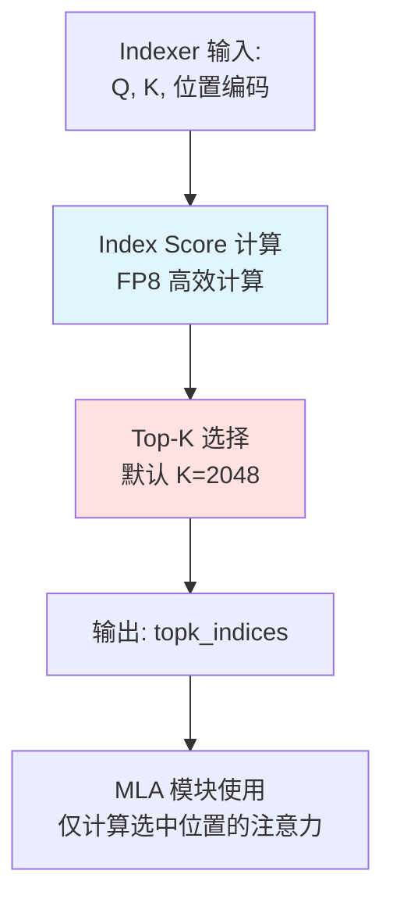
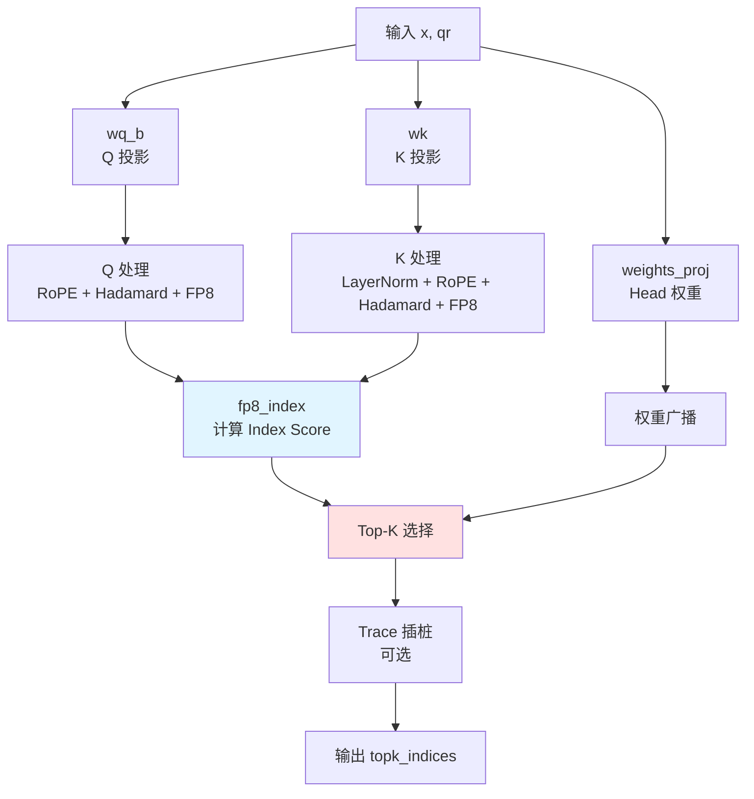

# MODEL_INDEXER.md - DSA Indexer 模块详解

## 目录

- [1. 概述](#1-概述)
- [2. DSA (DeepSeek Sparse Attention) 原理](#2-dsa-deepseek-sparse-attention-原理)
- [3. Indexer 类定义](#3-indexer-类定义)
- [4. forward 方法详解](#4-forward-方法详解)
- [5. 完整数据流](#5-完整数据流)

## 1. 概述

**Indexer** 是 DeepSeek Sparse Attention (DSA) 的核心组件，负责从整个 KV Cache 中**选择最相关的 Top-K 个位置**进行稀疏注意力计算。


## 2. DSA (DeepSeek Sparse Attention) 原理

### 2.1 稀疏注意力动机

**标准注意力**：计算 Query 与所有 Key 的相关性
$$ \text{Attention}(Q, K) = \text{softmax}\left(\frac{QK^T}{\sqrt{d_k}}\right) $$

**复杂度**：$O(S^2)$，$S$ 是序列长度

**DSA 稀疏注意力**：只计算 Top-K 个最相关的位置
$$ \text{DSA-Attention}(Q, K) = \text{softmax}\left(\frac{Q \cdot K_{\text{topk}}^T}{\sqrt{d_k}}\right) $$

**复杂度**：$O(S \times K)$，$K=2048$

### 2.2 Indexer 的作用

Indexer **不是**计算最终的注意力值，而是：

1. 计算每个位置的 **index score**（相关性分数）
2. 选择 **Top-K** 个位置
3. 返回位置索引，供 MLA 模块使用



### 2.3 Index Score 公式

$$ \text{index\_score}[i, j] = \sum_{h=1}^{H} \text{ReLU}\left(\text{score}_h[i, j]\right) \times w_h $$

其中：
- $\text{score}_h[i, j]$ 是第 $h$ 个 head 对位置 $j$ 的原始分数
- $w_h$ 是该 head 的权重
- $H$ 是 Indexer head 数量（默认 64）

## 3. Indexer 类定义

### 3.1 类结构

**位置**: `model.py:L460-L479`

```python
class Indexer(torch.nn.Module):
    def __init__(self, args: ModelArgs):
        super().__init__()
        self.dim: int = args.dim
        self.n_heads: int = args.index_n_heads          # 64
        self.n_local_heads = args.index_n_heads // world_size
        self.head_dim: int = args.index_head_dim        # 128
        self.rope_head_dim: int = args.qk_rope_head_dim # 64
        self.index_topk: int = args.index_topk          # 2048
        self.q_lora_rank: int = args.q_lora_rank        # 0

        self.wq_b = Linear(self.q_lora_rank, self.n_heads * self.head_dim)
        self.wk = Linear(self.dim, self.head_dim)
        self.k_norm = LayerNorm(self.head_dim)
        self.weights_proj = Linear(self.dim, self.n_heads, dtype=torch.float32)
        self.softmax_scale = self.head_dim ** -0.5
        self.scale_fmt = args.scale_fmt

        self.register_buffer("k_cache", torch.zeros(..., dtype=torch.float8_e4m3fn))
        self.register_buffer("k_scale_cache", torch.zeros(..., dtype=torch.float32))
        self._trace_layer_id: int = -1
```

### 3.2 参数表

| 参数 | 形状 | 数据类型 | 说明 |
|------|------|----------|------|
| `wq_b.weight` | $(n_h \times d, q_{rank})$ | BF16/FP8 | Q 投影权重 |
| `wk.weight` | $(d, d_h)$ | BF16/FP8 | K 投影权重 |
| `weights_proj.weight` | $(d, n_h)$ | FP32 | Per-head 权重 |
| `k_cache` | $(B, S, d_h)$ | FP8 | K 值缓存 |
| `k_scale_cache` | $(B, S, d_h/128)$ | FP32 | K scale 缓存 |

### 3.3 模块架构



## 4. forward 方法详解

**位置**: `model.py:L483-L538`

### 4.1 函数签名

```python
def forward(self, x: torch.Tensor, qr: torch.Tensor, start_pos: int,
            freqs_cis: torch.Tensor, mask: Optional[torch.Tensor]):
```

| 参数 | 形状 | 说明 |
|------|------|------|
| `x` | $(B, S, d)$ | 输入隐藏状态 |
| `qr` | $(B, S, q_{rank})$ | Q 的 LoRA 投影结果 |
| `start_pos` | int | 当前起始位置 |
| `freqs_cis` | $(S, d_{rope}/2)$ | 预计算的 RoPE |
| `mask` | $(S, S)$ or None | 注意力掩码 |

### 4.2 完整流程图

```mermaid
flowchart TD
    subgraph Step1 ["步骤 1: Q 投影"]
        A1[wq_b 投影<br/>q = wq_b@qr] --> A2[reshape:<br/>(B, S, H, D)]
        A2 --> A3[split:<br/>q_pe, q_nope]
        A3 --> A4[RoPE 应用<br/>q_pe = RoPE]
        A4 --> A5[拼接<br/>q = cat]
    end

    subgraph Step2 ["步骤 2: K 投影"]
        B1[wk 投影<br/>k = wk@x] --> B2[LayerNorm<br/>k_norm]
        B2 --> B3[split:<br/>k_pe, k_nope]
        B3 --> B4[RoPE 应用<br/>k_pe = RoPE]
        B4 --> B5[拼接<br/>k = cat]
    end

    subgraph Step3 ["步骤 3: Hadamard + FP8"]
        C1[q: rotate_activation] --> C2[k: rotate_activation]
        C2 --> C3[q_fp8, q_scale = act_quant]
        C3 --> C4[k_fp8, k_scale = act_quant]
    end

    subgraph Step4 ["步骤 4: 更新 Cache"]
        D1[k_cache写入<br/>k_fp8] --> D2[k_scale写入]
    end

    subgraph Step5 ["步骤 5: 计算 Weights"]
        E1[weights_proj<br/>w = weights_proj@x] --> E2[归一化<br/>× H^-0.5 × softmax_scale]
        E2 --> E3[乘以 q_scale<br/>× q_scale]
    end

    subgraph Step6 ["步骤 6: Index Score"]
        F1[从 Cache 读取 k<br/>end_pos 位置] --> F2[reshape: 连续化]
        F3[读取 k_scale] --> F4[reshape: 连续化]
        F2 --> F5[fp8_index<br/>计算 score]
        F4 --> F5
        E3 --> F5
    end

    subgraph Step7 ["步骤 7: Top-K 选择"]
        G1[index_score] --> G2[topk<br/>k=2048]
        G2 --> G3[Broadcast<br/>多卡一致性]
    end

    subgraph Step8 ["步骤 8: Trace"]
        H1{tracer enabled?} -->|是| H2[record_dsa_topk]
        H1 -->|否| I[输出]
        H2 --> I
    end

    A5 --> C1
    B5 --> C2
    F5 --> G1
    G3 --> H1

    style A5 fill:#e1f5ff
    style B5 fill:#e1f5ff
    style C4 fill:#fff3e0
    style F5 fill:#e8f5e9
    style G2 fill:#ffe1e1
```

### 4.3 逐行代码解读

#### 4.3.1 初始化

```python
# model.py:L484-L485
bsz, seqlen, _ = x.size()
end_pos = start_pos + seqlen
```

| 变量 | 含义 |
|------|------|
| `bsz` | 批大小 |
| `seqlen` | 当前输入序列长度（decode 时为 1） |
| `end_pos` | 结束位置（总序列长度） |

#### 4.3.2 Q 投影与处理

```python
# model.py:L486-L491
q = self.wq_b(qr)
q = q.view(bsz, seqlen, self.n_heads, self.head_dim)
q_pe, q_nope = torch.split(q, [self.rope_head_dim, self.head_dim - self.rope_head_dim], dim=-1)
q_pe = apply_rotary_emb(q_pe, freqs_cis, False)
q = torch.cat([q_pe, q_nope], dim=-1)
```

**形状变化**：

| 阶段 | 形状 | 说明 |
|------|------|------|
| `qr` | $(B, S, q_{rank})$ | 输入（$q_{rank}=0$ 时为空） |
| `q` | $(B, S, H \times D)$ | 投影后，$H=64, D=128$ |
| `q` view 后 | $(B, S, H, D)$ | 分离 head |
| `q_pe` | $(B, S, H, 64)$ | RoPE 部分 |
| `q_nope` | $(B, S, H, 64)$ | 非 RoPE 部分 |
| `q` 拼接后 | $(B, S, H, 128)$ | 完整 Q |

**关键点**：
- `apply_rotary_emb(..., False)` - **非交错模式**（与 MLA 不同）

#### 4.3.3 K 投影与处理

```python
# model.py:L492-L497
k = self.wk(x)
k = self.k_norm(k)
k_pe, k_nope = torch.split(k, [self.rope_head_dim, self.head_dim - self.rope_head_dim], dim=-1)
k_pe = apply_rotary_emb(k_pe.unsqueeze(2), freqs_cis, False).squeeze(2)
k = torch.cat([k_pe, k_nope], dim=-1)
```

**形状变化**：

| 阶段 | 形状 | 说明 |
|------|------|------|
| `x` | $(B, S, d)$ | 输入，$d=2048$ |
| `k` | $(B, S, D)$ | 投影后，$D=128$ |
| `k` normalize | $(B, S, D)$ | LayerNorm 后 |
| `k_pe` | $(B, S, 64)$ | RoPE 部分 |
| `k_nope` | $(B, S, 64)$ | 非 RoPE 部分 |
| `k` 拼接后 | $(B, S, 128)$ | 完整 K |

**关键点**：
- `k.unsqueeze(2)` - 添加 head 维度（K 只有 1 个 head）
- 同样使用**非交错模式** RoPE

#### 4.3.4 Hadamard 变换与 FP8 量化

```python
# model.py:L498-L501
q = rotate_activation(q)
k = rotate_activation(k)
q_fp8, q_scale = act_quant(q, block_size, self.scale_fmt)
k_fp8, k_scale = act_quant(k, block_size, self.scale_fmt)
```

**rotate_activation**：
- 输入: $(B, S, H, D)$
- 输出: $(B, S \times H, D)$ - Hadamard 作用在最后一维

**act_quant**：
- 输入: $(B, S \times H, D)$ BF16
- 输出: FP8 + scale FP32

#### 4.3.5 更新 K Cache

```python
# model.py:L502-L503
self.k_cache[:bsz, start_pos:end_pos] = k_fp8
self.k_scale_cache[:bsz, start_pos:end_pos] = k_scale
```

**Cache 形状**：

| Cache | 形状 | 数据类型 |
|-------|------|----------|
| `k_cache` | $(B, S_{max}, 128)$ | FP8 |
| `k_scale_cache` | $(B, S_{max}, 1)$ | FP32 |

#### 4.3.6 计算权重

```python
# model.py:L504-L507
weights = self.weights_proj(x.float()) * self.n_heads ** -0.5
weights = weights.unsqueeze(-1) * q_scale * self.softmax_scale
weights = weights.squeeze(-1)
```

**计算流程**：

```mermaid
flowchart LR
    A[x.float<br/>(B, S, d)] --> B[weights_proj<br/>(B, S, H)]
    B --> C[× H^-0.5<br/>归一化]
    C --> D[× q_scale<br/>(B, S, H)]
    D --> E[× softmax_scale<br/>× D^-0.5]
    E --> F[输出 weights<br/>(B, S, H)]

    style D fill:#e1f5ff
```

#### 4.3.7 读取 K Cache

```python
# model.py:L508-L514
k = self.k_cache[:bsz, :end_pos]
k_s = self.k_scale_cache[:bsz, :end_pos].squeeze(-1)

k = k.reshape(bsz * end_pos, self.head_dim).contiguous().reshape(bsz, end_pos, self.head_dim)
k_s = k_s.reshape(bsz * end_pos).contiguous().reshape(bsz, end_pos)
```

**形状变化**：

| 阶段 | 形状 | 说明 |
|------|------|------|
| `k` 读取后 | $(B, end\_pos, 128)$ | 从 Cache |
| `k` reshape | $(B \times end\_pos, 128)$ | 展平 |
| `k` 最终 | $(B, end\_pos, 128)$ | 连续内存 |
| `k_s` 最终 | $(B, end\_pos)$ | 连续内存 |

#### 4.3.8 计算 Index Score

```python
# model.py:L516
index_score = fp8_index(q_fp8.contiguous(), weights.contiguous(), k, k_s)
```

**输入输出**：

| 变量 | 形状 | 数据类型 |
|------|------|----------|
| `q_fp8` | $(B, S \times H, D)$ | FP8 |
| `weights` | $(B, S, H)$ | FP32 |
| `k` | $(B, end\_pos, D)$ | FP8 |
| `k_s` | $(B, end\_pos)$ | FP32 |
| `index_score` | $(B, S, end\_pos)$ | FP32 |

#### 4.3.9 Top-K 选择

```python
# model.py:L517-L529
if mask is not None:
    index_score += mask
k = min(self.index_topk, end_pos)
tracer = ds_trace.get_tracer()
trace_decode_only = (mask is None and seqlen == 1)
if tracer.enabled and trace_decode_only:
    topk_values, topk_indices = index_score.topk(k, dim=-1)
else:
    topk_values = None
    topk_indices = index_score.topk(k, dim=-1)[1]
topk_indices_ = topk_indices.clone()
dist.broadcast(topk_indices_, src=0)
assert torch.all(topk_indices == topk_indices_)
```

**关键点**：
1. **Mask 处理**：Prefill 时应用 causal mask
2. **Top-K**：沿最后一维选择最大的 $k$ 个值
3. **多卡一致性**：Broadcast 并验证所有 rank 的结果相同

**形状**：

| 变量 | 形状 | 说明 |
|------|------|------|
| `index_score` | $(B, S, end\_pos)$ | 所有位置的分数 |
| `topk_indices` | $(B, S, K)$ | 选中位置的索引 |
| `topk_values` | $(B, S, K)$ | 选中位置的分数 |

#### 4.3.10 Trace 插桩

```python
# model.py:L530-L537
if tracer.enabled and trace_decode_only:
    tracer.record_dsa_topk(
        layer_id=int(self._trace_layer_id),
        start_pos=int(start_pos),
        end_pos=int(end_pos),
        topk_indices=topk_indices,
        topk_scores=topk_values,
    )
```

**仅 decode 阶段记录**：
- `mask is None`：非 prefill
- `seqlen == 1`：单步 decode

#### 4.3.11 返回结果

```python
# model.py:L538
return topk_indices
```

## 5. 完整数据流

### 5.1 张量形状总结表

假设 $B=1, S=1$ (decode), $H=64, D=128, end\_pos=1000$：

| 阶段 | 变量 | 形状 | 数据类型 |
|------|------|------|----------|
| 输入 | `x` | $(1, 1, 2048)$ | BF16 |
| Q 投影 | `q` | $(1, 1, 8192)$ | BF16 |
| Q reshape | `q` | $(1, 1, 64, 128)$ | BF16 |
| Q after RoPE | `q` | $(1, 1, 64, 128)$ | BF16 |
| Q after Hadamard | `q` | $(1, 64, 128)$ | BF16 |
| Q FP8 | `q_fp8` | $(1, 64, 128)$ | FP8 |
| Q scale | `q_scale` | $(1, 64)$ | FP32 |
| K 投影 | `k` | $(1, 1, 128)$ | BF16 |
| K after RoPE | `k` | $(1, 1, 128)$ | BF16 |
| K FP8 | `k_fp8` | $(1, 1, 128)$ | FP8 |
| K Cache | `k_cache` | $(1, 1000, 128)$ | FP8 |
| Weights | `weights` | $(1, 1, 64)$ | FP32 |
| Index Score | `index_score` | $(1, 1, 1000)$ | FP32 |
| Top-K Indices | `topk_indices` | $(1, 1, 2048)$ | int64 |

### 5.2 与 MLA 的交互

```mermaid
flowchart TD
    A[MLA.forward] --> B[Indexer.forward]
    B --> C[返回 topk_indices<br/>(B, S, K)]
    C --> D[MLA 使用]
    D --> E[根据 indices<br/>从 KV Cache 取值]
    E --> F[计算稀疏注意力]

    style B fill:#e1f5ff
    style C fill:#ffe1e1
```

### 5.3 Decode 阶段调用链

```
Transformer.forward()
  └─> Block.forward()
        └─> MLA.forward()
              ├─> Indexer.forward()  [本模块]
              │     └─> 返回 topk_indices
              └─> 使用 topk_indices 计算稀疏注意力
```

---

**下一步**: 阅读 [MODEL_MLA.md](MODEL_MLA.md) 了解 MLA Attention 模块的实现。
