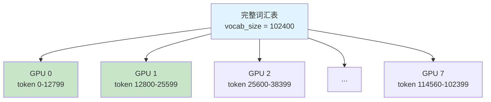
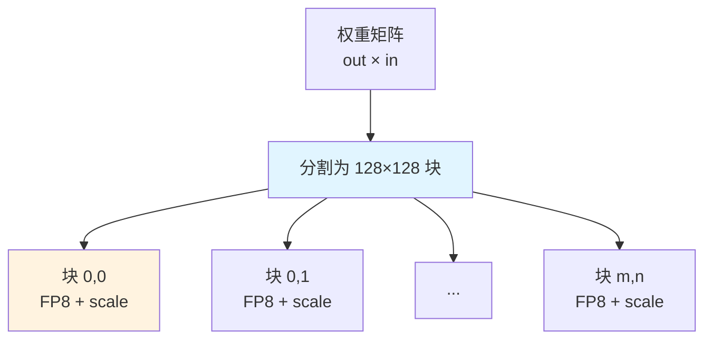

# MODEL_LINEAR.md - 线性层与嵌入层详解

## 目录

- [1. 概述](#1-概述)
- [2. ParallelEmbedding](#2-parallelembedding)
- [3. Linear](#3-linear)
- [4. ColumnParallelLinear](#4-columnparallellinear)
- [5. RowParallelLinear](#5rowparallellinear)
- [6. 数据流图](#6-数据流图)

## 1. 概述

DeepSeek-V3.2-Exp 使用**张量并行 (Tensor Parallelism)** 进行分布式训练和推理。线性层分为列并行和行并行两种：

```mermaid
flowchart LR
    A[输入 x<br/>(M, K)] --> B[ColumnParallel<br/>按列切分权重]
    B --> C[计算 y1<br/>(M, N/world_size)]
    C --> D[后续计算]
    D --> E[RowParallel<br/>按行切分权重]
    E --> F[计算 y2<br/>(M, N/world_size)]
    F --> G[AllReduce<br/>求和]
    G --> H[输出 y<br/>(M, N)]

    style B fill:#e1f5ff
    style G fill:#ffe1e1
```

## 2. ParallelEmbedding

### 2.1 类定义

**位置**: `model.py:L93-L132`

```python
class ParallelEmbedding(nn.Module):
    """支持并行的嵌入层"""
    def __init__(self, vocab_size: int, dim: int):
        super().__init__()
        self.vocab_size = vocab_size
        self.dim = dim
        assert vocab_size % world_size == 0
        self.part_vocab_size = vocab_size // world_size
        self.vocab_start_idx = rank * self.part_vocab_size
        self.vocab_end_idx = self.vocab_start_idx + self.part_vocab_size
        self.weight = nn.Parameter(torch.empty(self.part_vocab_size, dim))
```

### 2.2 词汇表切分



**切分公式**：
- 每个卡负责 $\text{vocab\_size} / \text{world\_size}$ 个 token
- GPU $r$ 负责 $[r \times \text{part}, (r+1) \times \text{part})$

### 2.3 前向传播

**位置**: `model.py:L111-L132`

```python
def forward(self, x: torch.Tensor) -> torch.Tensor:
    if world_size > 1:
        mask = (x < self.vocab_start_idx) | (x >= self.vocab_end_idx)
        x = x - self.vocab_start_idx
        x[mask] = 0
    y = F.embedding(x, self.weight)
    if world_size > 1:
        y[mask] = 0
        dist.all_reduce(y)
    return y
```

#### 计算流程

```mermaid
flowchart TD
    A[输入 token_ids<br/>(B, S)] --> B{world_size > 1?}
    B -->|否| G[直接 embedding]
    B -->|是| C[创建 mask<br/>标记非本卡的 token]
    C --> D[偏移 token_id<br/>x -= vocab_start_idx]
    D --> E[Embedding 查找]
    E --> F[将非本卡的输出置 0]
    F --> H[AllReduce Sum<br/>跨卡求和]
    G --> I[输出<br/>(B, S, D)]
    H --> I

    style F fill:#ffe1e1
    style H fill:#e8f5e9
```

#### 张量形状

| 阶段 | 形状 | 说明 |
|------|------|------|
| 输入 x | $(B, S)$ | token IDs |
| mask | $(B, S)$ | 布尔掩码 |
| y (AllReduce 前) | $(B, S, D)$ | 非本卡位置为 0 |
| y (AllReduce 后) | $(B, S, D)$ | 完整嵌入 |

## 3. Linear

### 3.1 类定义

**位置**: `model.py:L167-L206`

```python
class Linear(nn.Module):
    dtype = torch.bfloat16
    scale_fmt: Optional[str] = None

    def __init__(self, in_features: int, out_features: int, bias: bool = False, dtype = None):
        super().__init__()
        self.in_features = in_features
        self.out_features = out_features
        self.weight = nn.Parameter(torch.empty(out_features, in_features,
                                               dtype=dtype or Linear.dtype))
        if self.weight.element_size() == 1:  # FP8
            scale_out_features = (out_features + block_size - 1) // block_size
            scale_in_features = (in_features + block_size - 1) // block_size
            self.weight.scale = self.scale = nn.Parameter(
                torch.empty(scale_out_features, scale_in_features, dtype=torch.float32))
        else:
            self.register_parameter("scale", None)
        # ... bias 处理
```

### 3.2 FP8 权重存储

**位置**: `model.py:L185-L190`

```python
if self.weight.element_size() == 1:
    # FP8 权重需要额外的 scale 参数
    scale_out_features = (out_features + block_size - 1) // block_size
    scale_in_features = (in_features + block_size - 1) // block_size
    self.weight.scale = nn.Parameter(
        torch.empty(scale_out_features, scale_in_features, dtype=torch.float32))
```

#### 块级量化布局



**Scale 张量形状**：
$$ \text{scale.shape} = (\lceil \text{out\_features} / 128 \rceil, \lceil \text{in\_features} / 128 \rceil) $$

### 3.3 前向传播

**位置**: `model.py:L196-L206`

```python
def forward(self, x: torch.Tensor) -> torch.Tensor:
    return linear(x, self.weight, self.bias, self.scale_fmt)
```

调用 `MODEL_BASE.md` 中定义的 `linear()` 函数。

## 4. ColumnParallelLinear

### 4.1 类定义

**位置**: `model.py:L209-L235`

```python
class ColumnParallelLinear(Linear):
    """列并行线性层：输出维度被切分"""
    def __init__(self, in_features: int, out_features: int, bias: bool = False, dtype = None):
        assert out_features % world_size == 0
        self.part_out_features = out_features // world_size
        super().__init__(in_features, self.part_out_features, bias, dtype)
```

### 4.2 权重切分

```mermaid
flowchart TD
    A[完整权重矩阵<br/>out × in] --> B[GPU 0<br/>out/8 × in<br/>行 0-(out/8-1)]
    A --> C[GPU 1<br/>out/8 × in<br/>行 out/8-(2×out/8-1)]
    A --> D["..."]
    A --> E[GPU 7<br/>out/8 × in<br/>行 7×out/8-out]

    style A fill:#e1f5ff
    style B fill:#c8e6c9
```

**切分方式**：按**输出维度**（行）切分。

### 4.3 前向传播

**位置**: `model.py:L224-L235`

```python
def forward(self, x: torch.Tensor) -> torch.Tensor:
    y = linear(x, self.weight, self.bias, self.scale_fmt)
    return y
```

**特点**：输出**不需要** AllReduce，因为每个卡的输出就是最终输出的一部分。

### 4.4 张量形状

| 变量 | 完整形状 | 单卡形状 |
|------|----------|----------|
| 输入 x | $(M, K)$ | $(M, K)$ - 完整 |
| 权重 W | $(N, K)$ | $(N/8, K)$ - 切分 |
| 输出 y | $(M, N)$ | $(M, N/8)$ - 部分 |

## 5. RowParallelLinear

### 5.1 类定义

**位置**: `model.py:L238-L270`

```python
class RowParallelLinear(Linear):
    """行并行线性层：输入维度被切分"""
    def __init__(self, in_features: int, out_features: int, bias: bool = False,
                 reduce_output = True, dtype = None):
        assert in_features % world_size == 0
        self.part_in_features = in_features // world_size
        self.reduce_output = reduce_output
        super().__init__(self.part_in_features, out_features, bias, dtype)
```

### 5.2 权重切分

```mermaid
flowchart TD
    A[完整权重矩阵<br/>out × in] --> B[GPU 0<br/>out × in/8<br/>列 0-(in/8-1)]
    A --> C[GPU 1<br/>out × in/8<br/>列 in/8-(2×in/8-1)]
    A --> D["..."]
    A --> E[GPU 7<br/>out × in/8<br/>列 7×in/8-in]

    style A fill:#e1f5ff
    style B fill:#c8e6c9
```

**切分方式**：按**输入维度**（列）切分。

### 5.3 前向传播

**位置**: `model.py:L254-L270`

```python
def forward(self, x: torch.Tensor) -> torch.Tensor:
    y = linear(x, self.weight, None, self.scale_fmt)
    if self.reduce_output and world_size > 1:
        y = y.float()
        dist.all_reduce(y)
    if self.bias is not None:
        y += self.bias
    return y.type_as(x)
```

**关键步骤**：
1. 本地矩阵乘法
2. **AllReduce** 求和（跨卡）
3. 添加 bias
4. 类型转换回原类型

### 5.4 AllReduce 操作

```mermaid
flowchart TD
    A[GPU 0: y0<br/>(M, N)] --> D[AllReduce Sum<br/>NCCL]
    B[GPU 1: y1<br/>(M, N)] --> D
    C[GPU 7: y7<br/>(M, N)] --> D

    D --> E[GPU 0: y0+y1+...+y7<br/>(M, N)]
    D --> F[GPU 1: y0+y1+...+y7<br/>(M, N)]
    D --> G[GPU 7: y0+y1+...+y7<br/>(M, N)]

    style D fill:#ffe1e1
```

### 5.5 张量形状

| 变量 | 完整形状 | 单卡输入 | 单卡输出 |
|------|----------|----------|----------|
| 输入 x | $(M, K)$ | $(M, K/8)$ | - |
| 权重 W | $(N, K)$ | $(N, K/8)$ | - |
| 本地 y | - | $(M, N)$ | $(M, N)$ |
| AllReduce 后 | - | - | $(M, N)$ |

### 5.6 reduce_output 参数

```python
self.reduce_output = reduce_output
```

- `True` (默认): 执行 AllReduce
- `False`: 不执行 AllReduce（用于某些特殊场景）

## 6. 数据流图

### 6.1 完整前向传播（张量并行）

```mermaid
flowchart LR
    subgraph Input ["输入层"]
        E[ParallelEmbedding<br/>切分词汇表]
    end

    subgraph Body ["Transformer Layers"]
        direction TB
        L1[Layer 0]
        L2[Layer 1]
        L3["..."]
    end

    subgraph Output ["输出层"]
        N[RMSNorm]
        H[ColumnParallelLinear<br/>切分输出]
    end

    E --> L1 --> L2 --> L3 --> N --> H

    H --> A[AllGather<br/>收集完整输出]
    A --> O[Logits<br/>(B, vocab_size)]

    style H fill:#e1f5ff
    style A fill:#ffe1e1
```

### 6.2 单层内部数据流

```mermaid
flowchart LR
    A[输入 x<br/>(M, K)] --> B[ColumnParallelLinear<br/>wq_a]
    B --> C[RMSNorm]
    C --> D[ColumnParallelLinear<br/>wq_b]

    D --> E[MLA Attention<br/>Indexer + Attn]

    E --> F[ColumnParallelLinear<br/>w1/w3]
    F --> G[MoE<br/>专家计算]
    G --> H[RowParallelLinear<br/>w2<br/>含 AllReduce]

    H --> I[输出<br/>(M, K)]

    style B fill:#e1f5ff
    style D fill:#e1f5ff
    style F fill:#e1f5ff
    style H fill:#ffe1e1
```

### 6.3 FP8 量化数据流

```mermaid
flowchart TD
    A[输入 x<br/>(M, K) BF16] --> B{weight.dtype?}
    B -->|BF16| C[标准 F.linear<br/>(M, K) @ (N, K)^T]
    B -->|FP8| D[FP8 路径]

    D --> E[act_quant<br/>量化 x]
    E --> F[x: FP8<br/>scale: FP32]

    F --> G[fp8_gemm<br/>FP8 矩阵乘法]
    G --> H[输出 y<br/>(M, N) BF16]

    style D fill:#e1f5ff
    style G fill:#fff3e0
```

---

**下一步**: 阅读 [MODEL_NORM.md](MODEL_NORM.md) 了解归一化层的实现。
