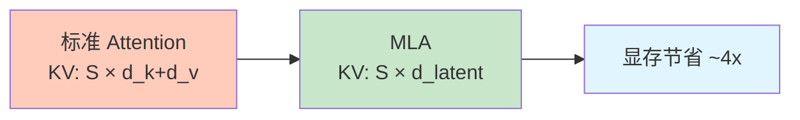
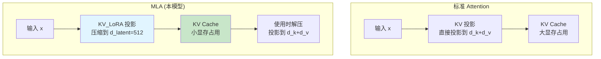
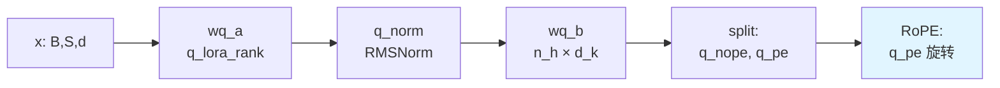
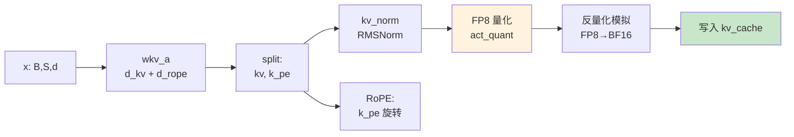
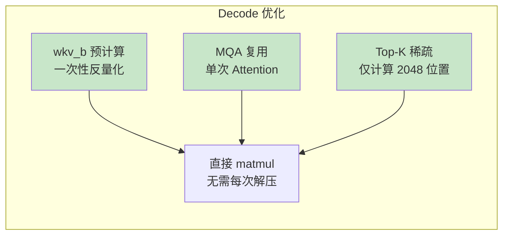

# MODEL_MLA.md - MLA Attention 模块详解

## 目录

- [1. 概述](#1-概述)
- [2. MLA 架构原理](#2-mla-架构原理)
- [3. MLA 类定义](#3-mla-类定义)
- [4. forward 方法详解](#4-forward-方法详解)
- [5. Prefill vs Decode](#5-prefill-vs-decode)

## 1. 概述

**MLA (Multi-Head Latent Attention)** 是 DeepSeek-V3.2-Exp 的核心注意力机制，通过低秩分解大幅减少 KV Cache 显存占用。



## 2. MLA 架构原理

### 2.1 低秩分解

**标准 Attention**：
$$ \text{KV Cache} = (K, V) \in \mathbb{R}^{S \times (d_k + d_v)} $$

**MLA**：
$$ K_{latent} \in \mathbb{R}^{S \times d_{kv}}, \quad K_{compressed} = K_{latent} \times W_{kv}^b $$
$$ V_{compressed} = K_{latent} \times W_{v}^b $$

### 2.2 架构对比



### 2.3 参数对比

| 参数 | 标准 Attention | MLA |
|------|--------------|-----|
| $d_{kv}$ (latent) | - | 512 |
| $d_{k\_nope}$ | 128 | 128 |
| $d_{rope}$ | 64 | 64 |
| $d_v$ | 128 | 128 |
| KV Cache / token | 192×2 = 384 bytes | 512×1 + 64×2 = 640 bytes |

**注意**：MLA 的 KV Cache 虽然更多字节，但压缩的是**计算维度**而非序列维度。

## 3. MLA 类定义

### 3.1 类结构

**位置**: `model.py:L549-L596`

```python
class MLA(nn.Module):
    def __init__(self, args: ModelArgs, layer_id: int = -1):
        super().__init__()
        self.layer_id = int(layer_id)
        # 维度配置
        self.dim = args.dim
        self.n_heads = args.n_heads
        self.n_local_heads = args.n_heads // world_size
        self.q_lora_rank = args.q_lora_rank
        self.kv_lora_rank = args.kv_lora_rank
        self.qk_nope_head_dim = args.qk_nope_head_dim
        self.qk_rope_head_dim = args.qk_rope_head_dim
        self.qk_head_dim = self.qk_nope_head_dim + self.qk_rope_head_dim
        self.v_head_dim = args.v_head_dim

        # Q 路径
        self.wq_a = Linear(self.dim, self.q_lora_rank)
        self.q_norm = RMSNorm(self.q_lora_rank)
        self.wq_b = ColumnParallelLinear(self.q_lora_rank, self.n_heads * self.qk_head_dim)

        # KV 路径
        self.wkv_a = Linear(self.dim, self.kv_lora_rank + self.qk_rope_head_dim)
        self.kv_norm = RMSNorm(self.kv_lora_rank)
        self.wkv_b = ColumnParallelLinear(self.kv_lora_rank,
                                           self.n_heads * (self.qk_nope_head_dim + self.v_head_dim))

        # 输出
        self.wo = RowParallelLinear(self.n_heads * self.v_head_dim, self.dim)

        # Indexer
        self.indexer = Indexer(args)
        self.indexer._trace_layer_id = self.layer_id

        # Cache
        self.register_buffer("kv_cache", torch.zeros(...))
        self.register_buffer("pe_cache", torch.zeros(...))
```

### 3.2 参数形状表

| 参数 | 输入维度 | 输出维度 | 说明 |
|------|----------|----------|------|
| `wq_a` | $d$ | $q_{rank}$ | Q 第一阶段投影（$q_{rank}=0$） |
| `wq_b` | $q_{rank}$ | $n_h \times d_k$ | Q 第二阶段投影 |
| `wkv_a` | $d$ | $d_{kv} + d_{rope}$ | KV 压缩投影 |
| `wkv_b` | $d_{kv}$ | $n_h \times (d_{nope} + d_v)$ | KV 解压投影 |
| `wo` | $n_h \times d_v$ | $d$ | 输出投影 |

### 3.3 Cache 配置

```python
# model.py:L594-L595
self.register_buffer("kv_cache", torch.zeros(args.max_batch_size, args.max_seq_len,
                                             self.kv_lora_rank), persistent=False)
self.register_buffer("pe_cache", torch.zeros(args.max_batch_size, args.max_seq_len,
                                              self.qk_rope_head_dim), persistent=False)
```

| Cache | 形状 | 说明 |
|-------|------|------|
| `kv_cache` | $(B, S_{max}, 512)$ | KV latent cache |
| `pe_cache` | $(B, S_{max}, 64)$ | RoPE 位置编码 cache |

## 4. forward 方法详解

**位置**: `model.py:L598-L661`

### 4.1 函数签名

```python
def forward(self, x: torch.Tensor, start_pos: int,
            freqs_cis: torch.Tensor, mask: Optional[torch.Tensor]):
```

| 参数 | 形状 | 说明 |
|------|------|------|
| `x` | $(B, S, d)$ | 输入隐藏状态 |
| `start_pos` | int | 当前起始位置 |
| `freqs_cis` | $(S, d_{rope}/2)$ | RoPE 频率 |
| `mask` | $(S, S)$ or None | Attention mask |

### 4.2 完整流程图

```mermaid
flowchart TD
    A[输入 x<br/>(B, S, d)] --> B{mask 存在?<br/>Prefill}
    B -->|是| C[Prefill 分支<br/>MHA dense]
    B -->|否| D[Decode 分支<br/>MQA sparse]

    subgraph Prefill ["Prefill: MHA Dense Attention"]
        C1[Q 路径] --> C2[KV 路径]
        C3[KV 解压] --> C4[完整 Attention]
        C5[Q 拼接] --> C4
        C4 --> C6[Indexer<br/>Top-K mask]
        C6 --> C7[Softmax + @V]
    end

    subgraph Decode ["Decode: MQA Sparse Attention"]
        D1[Q 路径<br/>Q_nope, Q_pe] --> D2[KV 直接使用<br/>from cache]
        D3[KV 投影解压<br/>预计算 wkv_b] --> D4[MQA Attention<br/>单次 matmul]
        D5[Indexer<br/>Top-K mask] --> D4
    end

    C7 --> E[输出投影<br/>wo]
    D4 --> E
    E --> F[输出<br/>(B, S, d)]

    style C fill:#e1f5ff
    style D fill:#fff3e0
```

### 4.3 逐行代码解读

#### 4.3.1 初始化

```python
# model.py:L611-L612
bsz, seqlen, _ = x.size()
end_pos = start_pos + seqlen
```

#### 4.3.2 Q 路径（通用）

```python
# model.py:L613-L617
qr = self.q_norm(self.wq_a(x))
q = self.wq_b(qr)
q = q.view(bsz, seqlen, self.n_local_heads, self.qk_head_dim)
q_nope, q_pe = torch.split(q, [self.qk_nope_head_dim, self.qk_rope_head_dim], dim=-1)
q_pe = apply_rotary_emb(q_pe, freqs_cis)
```

**Q 路径数据流**：



**形状变化**：

| 阶段 | 形状 | 说明 |
|------|------|------|
| `x` | $(B, S, d)$ | 输入 |
| `qr` | $(B, S, 0)$ | $q_{rank}=0$ |
| `q` | $(B, S, n_h \times d_k)$ | 投影后 |
| `q` view | $(B, S, n_h, d_k)$ | 分 head |
| `q_nope` | $(B, S, n_h, 128)$ | 非 RoPE 部分 |
| `q_pe` | $(B, S, n_h, 64)$ | RoPE 部分 |

#### 4.3.3 KV 路径（通用）

```python
# model.py:L618-L626
kv = self.wkv_a(x)
kv, k_pe = torch.split(kv, [self.kv_lora_rank, self.qk_rope_head_dim], dim=-1)
kv = self.kv_norm(kv)
k_pe = apply_rotary_emb(k_pe.unsqueeze(2), freqs_cis)
kv_fp8, kv_scale = act_quant(kv, block_size, self.scale_fmt)
kv = (kv_fp8.view(-1, block_size).float() * kv_scale.view(-1, 1)).to(kv.dtype).view_as(kv)
self.kv_cache[:bsz, start_pos:end_pos] = kv
self.pe_cache[:bsz, start_pos:end_pos] = k_pe.squeeze(2)
```

**KV 路径数据流**：



**形状变化**：

| 阶段 | 形状 | 说明 |
|------|------|------|
| `kv` | $(B, S, 576)$ | $d_{kv} + d_{rope} = 512 + 64$ |
| `kv` (latent) | $(B, S, 512)$ | 压缩的 KV |
| `k_pe` | $(B, 1, S, 64)$ | 位置编码 |
| `kv_fp8` | $(B, S, 512)$ | FP8 格式 |
| `kv_cache` | $(B, S_{max}, 512)$ | 累积 cache |

### 4.4 Prefill 分支

```python
# model.py:L627-L642
if mask is not None:  # MHA prefill
    q = torch.cat([q_nope, q_pe], dim=-1)
    kv = self.wkv_b(kv)
    kv = kv.view(bsz, seqlen, self.n_local_heads, self.qk_nope_head_dim + self.v_head_dim)
    k_nope, v = torch.split(kv, [self.qk_nope_head_dim, self.v_head_dim], dim=-1)
    k = torch.cat([k_nope, k_pe.expand(-1, -1, self.n_local_heads, -1)], dim=-1)
    scores = torch.einsum("bshd,bthd->bsht", q, k).mul_(self.softmax_scale)

    # indexer
    topk_indices = self.indexer(x, qr, start_pos, freqs_cis, mask)
    index_mask = torch.full((bsz, seqlen, seqlen), float("-inf"), device=x.device)
    index_mask = index_mask.scatter_(-1, topk_indices, 0)
    index_mask += mask
    scores += index_mask.unsqueeze(2)

    scores = scores.softmax(dim=-1)
    x = torch.einsum("bsht,bthd->bshd", scores, v)
```

**Prefill 数据流**：

```mermaid
flowchart TD
    A[q_nope, q_pe] --> B[拼接 Q]
    C[kv_cache] --> D[wkv_b 解压]
    D --> E[split: k_nope, v]
    F[pe_cache] --> G[拼接 K]
    E --> G
    B --> H[Attention Score<br/>Q @ K^T]
    G --> H
    H --> I[Indexer Top-K<br/>稀疏 mask]
    I --> J[Softmax]
    J --> K[@V]
    K --> L[输出]

    style I fill:#ffe1e1
```

**形状变化**：

| 阶段 | 形状 | 说明 |
|------|------|------|
| `q` | $(B, S, n_h, d_k)$ | 完整 Q |
| `kv` (解压) | $(B, S, n_h, 256)$ | $d_{nope} + d_v = 128 + 128$ |
| `k` | $(B, S, n_h, d_k)$ | 完整 K |
| `scores` | $(B, S, n_h, S)$ | Attention score |
| `index_mask` | $(B, S, S)$ | DSA mask |
| `output` | $(B, S, n_h, d_v)$ | Attention 输出 |

### 4.5 Decode 分支

```python
# model.py:L643-L659
else:  # MQA decode
    if self.dequant_wkv_b is None and self.wkv_b.scale is not None:
        self.dequant_wkv_b = weight_dequant(self.wkv_b.weight, self.wkv_b.scale)
    wkv_b = self.wkv_b.weight if self.dequant_wkv_b is None else self.dequant_wkv_b
    wkv_b = wkv_b.view(self.n_local_heads, -1, self.kv_lora_rank)
    q_nope = torch.einsum("bshd,hdc->bshc", q_nope, wkv_b[:, :self.qk_nope_head_dim])
    scores = (torch.einsum("bshc,btc->bsht", q_nope, self.kv_cache[:bsz, :end_pos]) +
              torch.einsum("bshr,btr->bsht", q_pe, self.pe_cache[:bsz, :end_pos])) * self.softmax_scale

    # indexer
    topk_indices = self.indexer(x, qr, start_pos, freqs_cis, mask)
    index_mask = torch.full((bsz, 1, end_pos), float("-inf"), device=x.device)
    index_mask = index_mask.scatter_(-1, topk_indices, 0)
    scores += index_mask.unsqueeze(2)

    scores = scores.softmax(dim=-1)
    x = torch.einsum("bsht,btc->bshc", scores, self.kv_cache[:bsz, :end_pos])
    x = torch.einsum("bshc,hdc->bshd", x, wkv_b[:, -self.v_head_dim:])
```

**Decode 数据流**：

```mermaid
flowchart TD
    A[q_nope: B,1,n_h,128] --> B[einsum<br/>× wkv_b_nope]
    B --> C[q_proj: B,1,n_h,512]

    D[kv_cache: B,end_pos,512] --> E[einsum<br/>q_proj @ kv_cache.T]
    F[q_pe: B,1,n_h,64] --> G[einsum<br/>× pe_cache.T]
    E --> H[scores 合成]
    G --> H

    H --> I[Indexer Top-K<br/>稀疏 mask]
    I --> J[Softmax]
    J --> K[@ kv_cache<br/>得到 context]
    K --> L[× wkv_b_v<br/>投影输出]

    style I fill:#ffe1e1
```

**形状变化**：

| 阶段 | 形状 | 说明 |
|------|------|------|
| `wkv_b` | $(n_h, 256, 512)$ | 解压权重 |
| `q_nope` (proj) | $(B, 1, n_h, 512)$ | Q 投影到 latent 空间 |
| `scores_nope` | $(B, 1, n_h, end\_pos)$ | 非 RoPE 分数 |
| `scores_pe` | $(B, 1, n_h, end\_pos)$ | RoPE 分数 |
| `scores` | $(B, 1, n_h, end\_pos)$ | 合并分数 |
| `context` | $(B, 1, n_h, 512)$ | Attention 输出 |
| `output` | $(B, 1, n_h, d_v)$ | 投影后输出 |

### 4.6 输出投影

```python
# model.py:L660
x = self.wo(x.flatten(2))
return x
```

**形状**：$(B, S, n_h \times d_v) \rightarrow (B, S, d)$

## 5. Prefill vs Decode

### 5.1 关键差异

| 特性 | Prefill | Decode |
|------|---------|--------|
| `seqlen` | $>1$ | $=1$ |
| `mask` | 存在 | None |
| Attention 类型 | MHA (dense) | MQA (sparse) |
| KV 解压 | 每次计算 | 预计算权重 |
| Indexer | 提供 mask | 提供 mask |
| 计算复杂度 | $O(S^2)$ | $O(S \times K)$ |

### 5.2 为什么 Decode 更快？



### 5.3 与 Indexer 的交互

**Prefill**：
```python
topk_indices = self.indexer(x, qr, start_pos, freqs_cis, mask)
index_mask = torch.full((bsz, seqlen, seqlen), float("-inf"), device=x.device)
index_mask.scatter_(-1, topk_indices, 0)
index_mask += mask  # 与 causal mask 合并
scores += index_mask.unsqueeze(2)
```

**Decode**：
```python
topk_indices = self.indexer(x, qr, start_pos, freqs_cis, mask)
index_mask = torch.full((bsz, 1, end_pos), float("-inf"), device=x.device)
index_mask.scatter_(-1, topk_indices, 0)
scores += index_mask.unsqueeze(2)
```

**Mask 作用**：将非 Top-K 位置的分数设为 $-\infty$，Softmax 后概率为 0。

---

**下一步**: 阅读 [MODEL_MOE.md](MODEL_MOE.md) 了解混合专家系统的实现。
