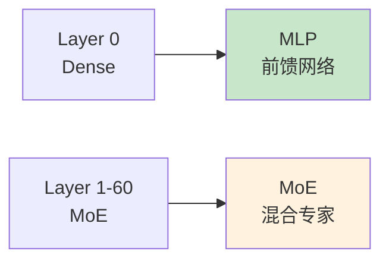
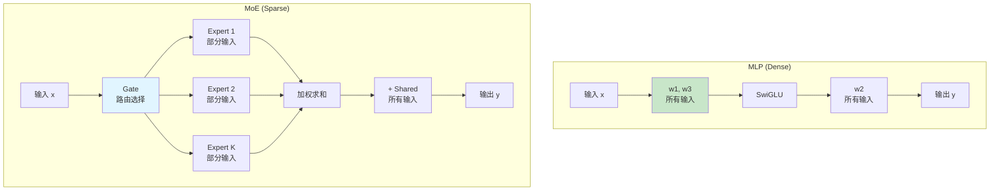

# MODEL_MLP.md - 前馈网络详解

## 目录

- [1. 概述](#1-概述)
- [2. MLP 类定义](#2-mlp-类定义)
- [3. SwiGLU 激活函数](#3-swiglu-激活函数)
- [4. 数据流](#4-数据流)
- [5. 与 MoE 的对比](#5-与-moe-的对比)

## 1. 概述

**MLP (Multi-Layer Perceptron)** 是前馈神经网络层，在 Transformer 中用于引入非线性变换。在 DeepSeek-V3.2-Exp 中：

- **Layer 0**: 使用标准 MLP (dense)
- **Layer 1-60**: 使用 MoE (稀疏)



## 2. MLP 类定义

### 2.1 类结构

**位置**: `model.py:L664-L696`

```python
class MLP(nn.Module):
    def __init__(self, dim: int, inter_dim: int, reduce_output: bool = True):
        super().__init__()
        self.w1 = ColumnParallelLinear(dim, inter_dim)
        self.w2 = RowParallelLinear(inter_dim, dim, reduce_output=reduce_output)
        self.w3 = ColumnParallelLinear(dim, inter_dim)
```

### 2.2 参数配置

| 参数 | 输入维度 | 输出维度 | 说明 |
|------|----------|----------|------|
| `w1` | $d$ | $inter$ | 第一个投影，gate 分支 |
| `w2` | $inter$ | $d$ | 输出投影（行并行） |
| `w3` | $d$ | $inter$ | 第三个投影，value 分支 |

### 2.3 并行配置

```python
# model.py:L673-L674
self.w1 = ColumnParallelLinear(dim, inter_dim)        # 列并行
self.w2 = RowParallelLinear(inter_dim, dim, reduce_output=reduce_output)  # 行并行
self.w3 = ColumnParallelLinear(dim, inter_dim)        # 列并行
```

```mermaid
flowchart TD
    A[输入 x<br/>(M, K)] --> B[w1: 列并行<br/>输出切分]
    A --> C[w3: 列并行<br/>输出切分]
    B --> D[SwiGLU 激活]
    C --> D
    D --> E[w2: 行并行<br/>输入切分 + AllReduce]
    E --> F[输出 y<br/>(M, N)]

    style B fill:#e1f5ff
    style C fill:#e1f5ff
    style E fill:#ffe1e1
```

## 3. SwiGLU 激活函数

### 3.1 数学公式

$$ \text{SwiGLU}(x) = \text{SiLU}(xW_1) \odot (xW_3) $$

展开为：
$$ \text{SwiGLU}(x) = \text{SiLU}(xW_1) \odot (xW_3)W_2 $$

其中：
- $W_1, W_3$ 是输入到隐藏层的权重
- $W_2$ 是隐藏层到输出的权重
- $\odot$ 是逐元素乘法
- $\text{SiLU}(x) = x \cdot \sigma(x) = \frac{x}{1 + e^{-x}}$

### 3.2 计算图

```mermaid
flowchart LR
    A[输入 x] --> B[w1 投影]
    A --> C[w3 投影]
    B --> D[SiLU 激活]
    C --> E[逐元素乘<br/>SiLU(w1x) × w3x]
    D --> E
    E --> F[w2 投影]
    F --> G[输出]

    style D fill:#fff3e0
    style E fill:#e8f5e9
```

### 3.3 SwiGLU vs ReLU

| 特性 | SwiGLU | ReLU |
|------|--------|------|
| 公式 | $\text{SiLU}(xW_1) \odot xW_3$ | $\max(0, x)$ |
| 门控机制 | 有 | 无 |
| 参数量 | $3 \times d \times inter$ | $2 \times d \times inter$ |
| 性能 | 通常更好 | 基准 |

## 4. 数据流

### 4.1 forward 方法

**位置**: `model.py:L686-L696`

```python
def forward(self, x: torch.Tensor) -> torch.Tensor:
    return self.w2((F.silu(self.w1(x).float()) * self.w3(x).float()).type_as(x))
```

### 4.2 逐步计算

```mermaid
flowchart TD
    A[输入 x<br/>(B, S, d)] --> B[w1: ColumnParallel<br/>(B, S, d) → (B, S, inter/8)]
    A --> C[w3: ColumnParallel<br/>(B, S, d) → (B, S, inter/8)]

    B --> D[SiLU 激活<br/>float 类型]
    C --> E[float 类型]

    D --> F[逐元素乘<br/>(B, S, inter/8)]
    E --> F

    F --> G[w2: RowParallel<br/>(B, S, inter/8) → (B, S, d)]
    G --> H[AllReduce<br/>跨卡求和]
    H --> I[输出 y<br/>(B, S, d)]

    style D fill:#fff3e0
    style F fill:#e8f5e9
    style H fill:#ffe1e1
```

### 4.3 张量形状变化

假设 $B=1, S=1, d=2048, inter=10944, world\_size=8$：

| 阶段 | 形状 | 说明 |
|------|------|------|
| 输入 `x` | $(1, 1, 2048)$ | 输入隐藏状态 |
| `w1(x)` | $(1, 1, 1368)$ | 列并行，$inter/8 = 1368$ |
| `w3(x)` | $(1, 1, 1368)$ | 列并行 |
| `SiLU(w1x) × w3x` | $(1, 1, 1368)$ | SwiGLU 激活 |
| `w2(...)` (AllReduce 前) | $(1, 1, 2048)$ | 行并行，本地部分 |
| `w2(...)` (AllReduce 后) | $(1, 1, 2048)$ | 完整输出 |
| 输出 `y` | $(1, 1, 2048)$ | 类型与输入相同 |

### 4.4 类型转换

```python
# model.py:L696
(F.silu(self.w1(x).float()) * self.w3(x).float()).type_as(x)
```

**转换流程**：
1. `w1(x).float()` - 转为 FP32
2. `F.silu(...)` - SiLU 激活（FP32）
3. `w3(x).float()` - 转为 FP32
4. 逐元素乘（FP32）
5. `.type_as(x)` - 转回输入类型（BF16）

**为什么用 FP32？**
- SwiGLU 的中间计算使用 FP32 提高精度
- 避免梯度溢出/消失

## 5. 与 MoE 的对比

### 5.1 架构对比



### 5.2 参数量对比

| 组件 | MLP | MoE (64 专家) |
|------|-----|--------------|
| Gate | - | $d \times n_{exp}$ |
| Experts | $3 \times d \times inter$ | $n_{exp} \times 3 \times d \times inter$ |
| Shared | - | $2 \times d \times 2 \times inter$ |
| **总计** | $3 \times d \times inter$ | $n_{exp} \times 3 \times d \times inter + 2 \times d \times 2 \times inter$ |

**激活参数量**：
- MLP: 全部参数
- MoE: 仅 $k + n_{shared}$ 个专家的参数（$k=6, n_{shared}=2$）

### 5.3 计算量对比

| 组件 | MLP | MoE (K=6) |
|------|-----|-----------|
| Gate 计算 | - | $M \times d \times n_{exp}$ |
| Expert 计算 | $M \times 3 \times d \times inter$ | $M \times k \times 3 \times d \times inter$ |
| Shared 计算 | - | $M \times 2 \times d \times 2 \times inter$ |
| **总计算量** | $3 \times M \times d \times inter$ | $\approx \frac{k}{n_{exp}} \times 3 \times M \times d \times inter$ |

**节省比例**：$\approx \frac{6}{64} \approx 9.4\%$

### 5.4 使用场景

| 层 | 类型 | 原因 |
|-----|------|------|
| Layer 0 | MLP | 需要处理所有输入，建立基础表示 |
| Layer 1-60 | MoE | 利用稀疏性提高容量和效率 |

---

**下一步**: 阅读 [MODEL_BLOCK.md](MODEL_BLOCK.md) 了解 Transformer Block 的实现。
