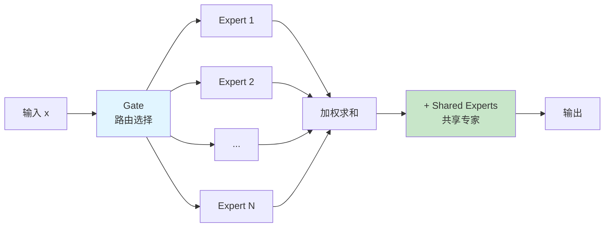
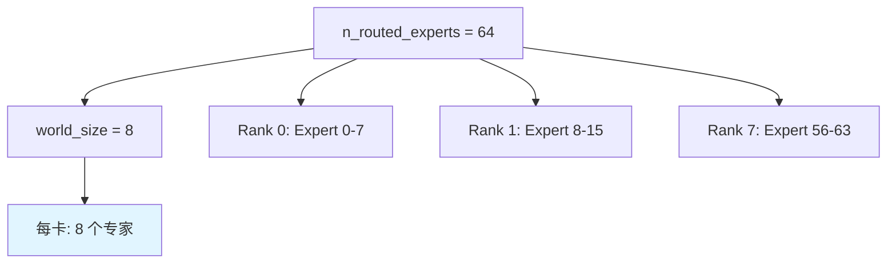
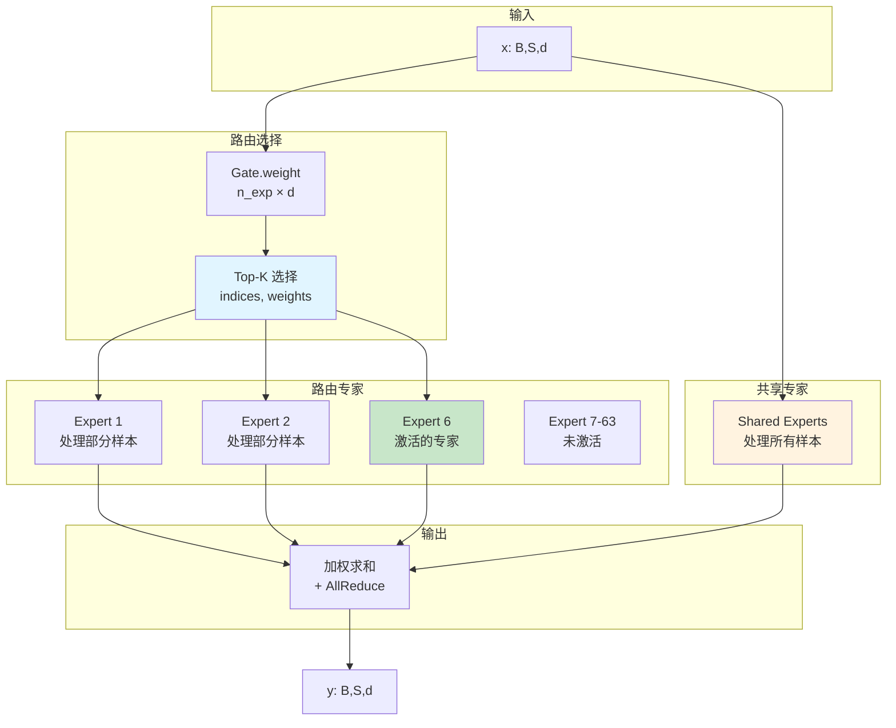

# MODEL_MOE.md - 混合专家系统详解

## 目录

- [1. 概述](#1-概述)
- [2. Gate 门控模块](#2-gate-门控模块)
- [3. Expert 专家模块](#3-expert-专家模块)
- [4. MoE 混合专家模块](#4-moe-混合专家模块)
- [5. 完整数据流](#5-完整数据流)

## 1. 概述

DeepSeek-V3.2-Exp 使用 **MoE (Mixture of Experts)** 架构，允许模型根据输入动态选择激活不同的专家子集。



## 2. Gate 门控模块

### 2.1 类定义

**位置**: `model.py:L699-L762`

```python
class Gate(nn.Module):
    def __init__(self, args: ModelArgs):
        super().__init__()
        self.dim = args.dim
        self.topk = args.n_activated_experts      # 6
        self.n_groups = args.n_expert_groups       # 1
        self.topk_groups = args.n_limited_groups   # 1
        self.score_func = args.score_func          # "softmax"
        self.route_scale = args.route_scale        # 1.0
        self.weight = nn.Parameter(torch.empty(args.n_routed_experts, args.dim))
        self.bias = nn.Parameter(torch.empty(args.n_routed_experts, dtype=torch.float32))
```

### 2.2 参数

| 参数 | 形状 | 说明 |
|------|------|------|
| `weight` | $(n_{exp}, d)$ | 专家权重矩阵 |
| `bias` | $(n_{exp},)$ | 专家偏置（仅某些模型） |

### 2.3 forward 方法

**位置**: `model.py:L730-L762`

```python
def forward(self, x: torch.Tensor) -> Tuple[torch.Tensor, torch.Tensor]:
    scores = linear(x.float(), self.weight.float())
    if self.score_func == "softmax":
        scores = scores.softmax(dim=-1)
    else:
        scores = scores.sigmoid()
    original_scores = scores
    if self.bias is not None:
        scores = scores + self.bias
    # ... 分组路由逻辑 ...
    indices = scores.topk(self.topk, dim=-1)[1]
    weights = original_scores.gather(1, indices)
    if self.score_func == "sigmoid":
        weights /= weights.sum(dim=-1, keepdim=True)
    weights *= self.route_scale
    return weights, indices
```

### 2.4 计算流程

```mermaid
flowchart TD
    A[输入 x<br/>(M, d)] --> B[线性投影<br/>scores = x @ W^T]
    B --> C{score_func?}
    C -->|softmax| D[Softmax<br/>∑=1]
    C -->|sigmoid| E[Sigmoid<br/>(0,1)]
    D --> F{有 bias?}
    E --> F
    F -->|是| G[scores += bias]
    F -->|否| H[Top-K 选择]
    G --> H
    H --> I[indices: Top-K 索引<br/>weights: 对应权重]
    I --> J{sigmoid?}
    J -->|是| K[归一化<br/>weights /= sum]
    J -->|否| L[× route_scale]
    K --> L
    L --> M[输出 weights, indices]

    style D fill:#e1f5ff
    style H fill:#ffe1e1
```

### 2.5 输出形状

| 变量 | 形状 | 说明 |
|------|------|------|
| 输入 `x` | $(M, d)$ | 展平后的输入 |
| `scores` | $(M, n_{exp})$ | 每个专家的分数 |
| `indices` | $(M, k)$ | Top-K 专家索引，$k=6$ |
| `weights` | $(M, k)$ | Top-K 专家权重 |

## 3. Expert 专家模块

### 3.1 类定义

**位置**: `model.py:L765-L797`

```python
class Expert(nn.Module):
    def __init__(self, dim: int, inter_dim: int):
        super().__init__()
        self.w1 = Linear(dim, inter_dim)
        self.w2 = Linear(inter_dim, dim)
        self.w3 = Linear(dim, inter_dim)
```

### 3.2 SwiGLU 激活函数

**公式**：
$$ \text{SwiGLU}(x) = \text{SiLU}(xW_1) \odot (xW_3) $$

其中：
- $\text{SiLU}(x) = \frac{x}{1 + e^{-x}} = x \cdot \sigma(x)$
- $\odot$ 是逐元素乘法

### 3.3 forward 方法

**位置**: `model.py:L787-L797`

```python
def forward(self, x: torch.Tensor) -> torch.Tensor:
    return self.w2((F.silu(self.w1(x).float()) * self.w3(x).float()).type_as(x))
```

### 3.4 计算流程

```mermaid
flowchart LR
    A[输入 x<br/>(M, d)] --> B[w1: d→inter]
    A --> C[w3: d→inter]

    B --> D[SiLU 激活]
    C --> E[逐元素乘<br/>SiLU(w1x) × w3x]
    D --> E
    E --> F[w2: inter→d]
    F --> G[输出 y<br/>(M, d)]

    style D fill:#fff3e0
    style E fill:#e8f5e9
```

### 3.5 张量形状

| 阶段 | 形状 | 说明 |
|------|------|------|
| 输入 `x` | $(M, d)$ | $d=2048$ |
| `w1(x)` | $(M, inter)$ | $inter=1408$ |
| `w3(x)` | $(M, inter)$ | $inter=1408$ |
| `SiLU(w1x) × w3x` | $(M, inter)$ | SwiGLU 激活 |
| `w2(...)` | $(M, d)$ | 投影回原维度 |

## 4. MoE 混合专家模块

### 4.1 类定义

**位置**: `model.py:L800-L857`

```python
class MoE(nn.Module):
    def __init__(self, args: ModelArgs):
        super().__init__()
        self.dim = args.dim
        self.n_routed_experts = args.n_routed_experts          # 64
        self.n_local_experts = args.n_routed_experts // world_size
        self.n_activated_experts = args.n_activated_experts    # 6
        self.experts_start_idx = rank * self.n_local_experts
        self.experts_end_idx = self.experts_start_idx + self.n_local_experts
        self.gate = Gate(args)
        self.experts = nn.ModuleList([Expert(...) if ... else None
                                      for i in range(self.n_routed_experts)])
        self.shared_experts = MLP(args.dim, args.n_shared_experts * args.moe_inter_dim,
                                   reduce_output=False)
```

### 4.2 分布式配置



### 4.3 forward 方法

**位置**: `model.py:L833-L857`

```python
def forward(self, x: torch.Tensor) -> torch.Tensor:
    shape = x.size()
    x = x.view(-1, self.dim)
    weights, indices = self.gate(x)
    y = torch.zeros_like(x, dtype=torch.float32)
    counts = torch.bincount(indices.flatten(), minlength=self.n_routed_experts).tolist()
    for i in range(self.experts_start_idx, self.experts_end_idx):
        if counts[i] == 0:
            continue
        expert = self.experts[i]
        idx, top = torch.where(indices == i)
        y[idx] += expert(x[idx]) * weights[idx, top, None]
    y += self.shared_experts(x)
    if world_size > 1:
        dist.all_reduce(y)
    return y.type_as(x).view(shape)
```

### 4.4 计算流程

```mermaid
flowchart TD
    A[输入 x<br/>(B, S, d)] --> B[展平<br/>(M, d)]
    B --> C[Gate<br/>weights, indices]
    C --> D[初始化输出<br/>y = zeros]
    C --> E[统计专家使用次数<br/>counts]

    D --> F{遍历本地专家}
    F --> G[找到路由到该专家的样本<br/>idx, top]
    G --> H[Expert 计算<br/>expert_x]
    H --> I[加权累加<br/>y += expert_x × weights]

    I --> J{还有专家?}
    J -->|是| F
    J -->|否| K[Shared Experts<br/>共享专家]
    K --> L[AllReduce<br/>跨卡求和]
    L --> M[reshape 回原形状<br/>(B, S, d)]
    M --> N[输出]

    style C fill:#e1f5ff
    style I fill:#fff3e0
    style L fill:#c8e6c9
```

### 4.5 张量形状变化

| 阶段 | 形状 | 说明 |
|------|------|------|
| 输入 `x` | $(B, S, d)$ | 例如 $(1, 1, 2048)$ |
| 展平 | $(M, d)$ | $M = B \times S = 1$ |
| `weights` | $(M, k)$ | $(1, 6)$ |
| `indices` | $(M, k)$ | $(1, 6)$ |
| `y` (累加前) | $(M, d)$ | $(1, 2048)$ |
| `y` (AllReduce 后) | $(M, d)$ | $(1, 2048)$ |
| 输出 | $(B, S, d)$ | $(1, 1, 2048)$ |

## 5. 完整数据流

### 5.1 MoE 层内部结构



### 5.2 条件路由逻辑

**位置**: `model.py:L748-L756`

```python
if self.n_groups > 1:
    scores = scores.view(x.size(0), self.n_groups, -1)
    if self.bias is None:
        group_scores = scores.amax(dim=-1)
    else:
        group_scores = scores.topk(2, dim=-1)[0].sum(dim=-1)
    indices = group_scores.topk(self.topk_groups, dim=-1)[1]
    mask = scores.new_ones(x.size(0), self.n_groups, dtype=bool).scatter_(1, indices, False)
    scores = scores.masked_fill_(mask.unsqueeze(-1), float("-inf")).flatten(1)
```

**分组路由**：
1. 将专家分成 `n_groups` 组
2. 计算每组分数
3. 选择 Top-K 组
4. 屏蔽未选中的组
5. 在选中组内选择 Top-K 专家

### 5.3 共享专家

```python
# model.py:L831
self.shared_experts = MLP(args.dim, args.n_shared_experts * args.moe_inter_dim,
                          reduce_output=False)
```

**特点**：
- 总是激活，处理所有输入
- 与路由专家的输出相加
- 提供"基础"能力

### 5.4 多卡通信

```python
# model.py:L855-L856
if world_size > 1:
    dist.all_reduce(y)
```

**AllReduce**：
- 每个卡计算本地专家的输出
- AllReduce 将所有卡的输出求和
- 确保每个样本的输出来自所有相关专家

---

**下一步**: 阅读 [MODEL_MLP.md](MODEL_MLP.md) 了解前馈网络的实现。
