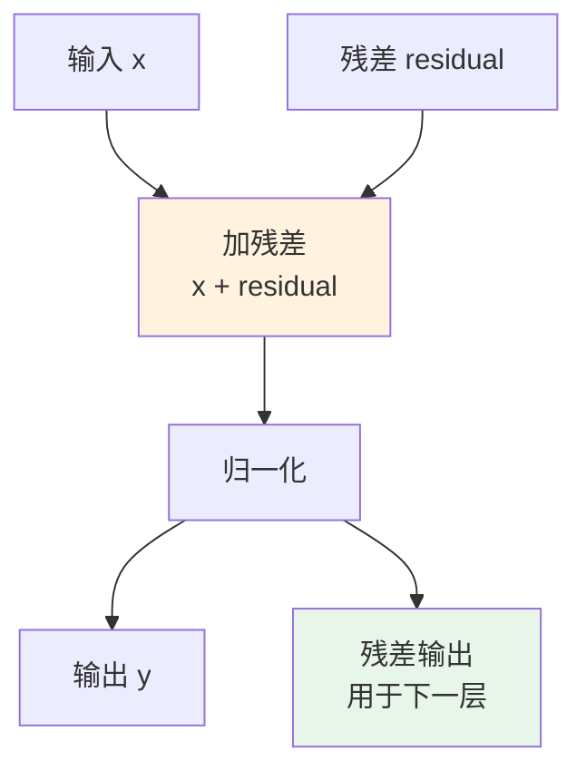
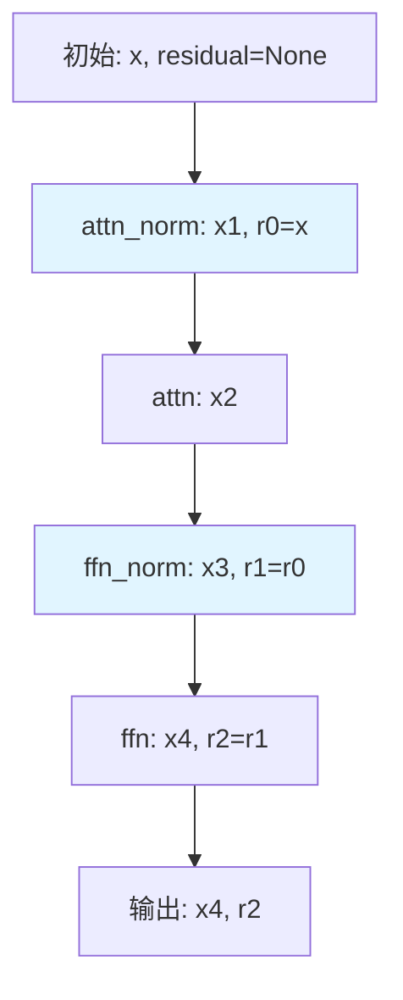

# MODEL_NORM.md - 归一化层详解

## 目录

- [1. 概述](#1-概述)
- [2. RMSNorm](#2-rmsnorm)
- [3. LayerNorm](#3-layernorm)
- [4. 数学原理](#4-数学原理)

## 1. 概述

DeepSeek-V3.2-Exp 使用两种归一化层：

| 层类型 | 用途 | 位置 |
|--------|------|------|
| RMSNorm | 主要归一化层 | Attention 前后、FFN 前后 |
| LayerNorm | 特殊用途 | kv_norm, q_norm |


## 2. RMSNorm

### 2.1 类定义

**位置**: `model.py:L273-L307`

```python
class RMSNorm(nn.Module):
    """Root Mean Square Layer Normalization"""
    def __init__(self, dim: int, eps: float = 1e-6):
        super().__init__()
        self.dim = dim
        self.eps = eps
        self.weight = nn.Parameter(torch.ones(dim, dtype=torch.float32))
```

### 2.2 数学公式

RMSNorm 计算公式：

$$ \text{RMS}(x) = \sqrt{\frac{1}{d} \sum_{i=1}^{d} x_i^2} $$

$$ \text{output} = \frac{x}{\text{RMS}(x) + \epsilon} \times g $$

其中：
- $x \in \mathbb{R}^d$ 是输入
- $g \in \mathbb{R}^d$ 是可学习的缩放参数 (weight)
- $\epsilon$ 是防止除零的小常数

### 2.3 前向传播（无残差）

**位置**: `model.py:L287-L302`

```python
def forward(self, x: torch.Tensor, residual: Optional[torch.Tensor] = None):
    dtype = x.dtype
    if residual is None:
        # 无残差连接模式
        x = x.float()
        var = x.pow(2).mean(-1, keepdim=True)
        x = x * torch.rsqrt(var + self.eps)
        return (self.weight * x).to(dtype)
```

#### 计算流程

```mermaid
flowchart TD
    A[输入 x<br/>(B, S, D)] --> B[转换为 float32]
    B --> C[计算平方<br/>x²]
    C --> D[沿最后一维求均值<br/>mean(x², -1)]
    D --> E[计算 RMS<br/>√mean + ε]
    E --> F[除以 RMS<br/>x / RMS]
    F --> G[乘以可学习参数<br/>× weight]
    G --> H[转换回原类型]

    style E fill:#ffe1e1
    style F fill:#e8f5e9
```

#### 张量形状

| 变量 | 形状 | 说明 |
|------|------|------|
| 输入 x | $(B, S, D)$ | $D=2048$ |
| x² | $(B, S, D)$ | 逐元素平方 |
| var | $(B, S, 1)$ | 沿 D 维求均值 |
| RMS | $(B, S, 1)$ | 均方根 |
| weight | $(D,)$ | 可学习参数 |
| 输出 | $(B, S, D)$ | 归一化后 |

### 2.4 前向传播（有残差）

**位置**: `model.py:L303-L307`

```python
else:
    # 有残差连接模式
    x = residual = x.float() + residual.float()
    var = x.pow(2).mean(-1, keepdim=True)
    x = x * torch.rsqrt(var + self.eps)
    return (self.weight * x).to(dtype), residual.to(dtype)
```

#### 残差连接模式



**返回值**：`(output, residual)` - 输出和新的残差。

### 2.5 RMSNorm vs LayerNorm

| 特性 | RMSNorm | LayerNorm |
|------|---------|-----------|
| 均值中心化 | 无 | 有 |
| 方差计算 | RMS (均方根) | 方差 |
| 参数 | 1 个 (weight) | 2 个 (weight, bias) |
| 计算量 | 更少 | 更多 |
| 效果 | 相近 | 相近 |

### 2.6 在模型中的使用

```python
# model.py:L881-L882 (Block.forward)
x, residual = self.attn_norm(x), x          # 预归一化
x = self.attn(x, start_pos, freqs_cis, mask)
x, residual = self.ffn_norm(x, residual)    # 预归一化 + 残差
x = self.ffn(x)
```

**Pre-Norm** 架构：归一化在子层之前。

## 3. LayerNorm

### 3.1 类定义

**位置**: `model.py:L310-L322`

```python
class LayerNorm(nn.Module):
    """标准层归一化"""
    def __init__(self, dim: int, eps: float = 1e-6):
        super().__init__()
        self.dim = dim
        self.eps = eps
        self.weight = nn.Parameter(torch.ones(dim, dtype=torch.float32))
        self.bias = nn.Parameter(torch.zeros(dim, dtype=torch.float32))
```

### 3.2 数学公式

LayerNorm 计算公式：

$$ \mu = \frac{1}{d} \sum_{i=1}^{d} x_i $$

$$ \sigma^2 = \frac{1}{d} \sum_{i=1}^{d} (x_i - \mu)^2 $$

$$ \text{output} = \frac{x - \mu}{\sqrt{\sigma^2 + \epsilon}} \times g + b $$

其中：
- $g$ 是 weight (缩放)
- $b$ 是 bias (偏移)

### 3.3 前向传播

**位置**: `model.py:L321-L322`

```python
def forward(self, x: torch.Tensor):
    return F.layer_norm(x.float(), (self.dim,), self.weight, self.bias, self.eps).type_as(x)
```

**实现**：直接使用 PyTorch 的 `F.layer_norm`。

### 3.4 在模型中的使用

LayerNorm 在本模型中用于特殊位置：

```python
# model.py:L471-L472 (Indexer)
self.wk = Linear(self.dim, self.head_dim)
self.k_norm = LayerNorm(self.head_dim)
```

用于 Key 的归一化（不是 RMSNorm）。

## 4. 数学原理

### 4.1 为什么需要归一化？

**问题**：深度网络中，激活值的分布会随着层数增加而偏移（Internal Covariate Shift）。

**解决**：归一化将每层的输入保持在稳定的分布。

### 4.2 RMSNorm 的推导

标准 LayerNorm：

$$ \text{LN}(x) = \frac{x - \mu}{\sigma} \times g + b $$

RMSNorm 简化（忽略均值中心化）：

$$ \text{RMS}(x) = \sqrt{\mathbb{E}[x^2]} = \sqrt{\frac{1}{d}\sum x_i^2} $$

$$ \text{output} = \frac{x}{\text{RMS}(x) + \epsilon} \times g $$

### 4.3 归一化在 Transformer 中的位置


**Pre-Norm 优势**：
- 梯度更稳定
- 更容易训练深层网络

### 4.4 残差连接 + 归一化

**位置**: `model.py:L897-L903`

```python
if residual is None:
    x, residual = self.attn_norm(x), x
else:
    x, residual = self.attn_norm(x, residual)
x = self.attn(x, start_pos, freqs_cis, mask)
x, residual = self.ffn_norm(x, residual)
x = self.ffn(x)
return x, residual
```

**执行流程**：



**残差累积**：
```
residual = 原始输入
x = Norm(x, residual)  # 第一次
x = Sublayer(x)        # Attention
x = Norm(x, residual)  # 第二次，residual 还是原始输入
x = Sublayer(x)        # FFN
return x, residual     # residual 仍然是原始输入
```

---

**下一步**: 阅读 [MODEL_ROPE.md](MODEL_ROPE.md) 了解旋转位置编码的实现。
