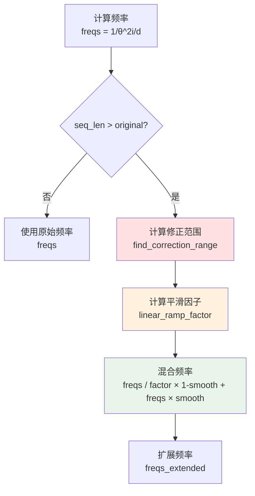

# MODEL_ROPE.md - 旋转位置编码详解

## 目录

- [1. 概述](#1-概述)
- [2. RoPE 基础原理](#2-rope-基础原理)
- [3. YaRN 扩展机制](#3-yarn-扩展机制)
- [4. precompute_freqs_cis](#4-precompute_freqs_cis)
- [5. apply_rotary_emb](#5-apply_rotary_emb)

## 1. 概述

DeepSeek-V3.2-Exp 使用 **YaRN (Yet another RoPE extensioN)** 扩展 RoPE 以支持长上下文：


## 2. RoPE 基础原理

### 2.1 核心思想

RoPE (Rotary Position Embedding) 通过**旋转变换**将位置信息注入 Query 和 Key。

### 2.2 数学公式

对于位置 $m$ 的向量 $x_m \in \mathbb{R}^d$，将其分为 $d/2$ 对：

$$ x_m = (x_{m,1}, x_{m,2}, \ldots, x_{m,d-1}, x_{m,d}) $$

形成 $d/2$ 个复数：
$$ z_m^{(i)} = x_{m,2i-1} + j \cdot x_{m,2i}, \quad i = 1, \ldots, d/2 $$

旋转角度：
$$ \Theta_i = 10000^{-2(i-1)/d} $$

旋转变换：
$$ \text{RoPE}(z_m^{(i)}) = z_m^{(i)} \cdot e^{j \cdot m \cdot \Theta_i} $$

### 2.3 矩阵形式

$$ \begin{pmatrix} x'_{m,2i-1} \\ x'_{m,2i} \end{pmatrix} = \begin{pmatrix} \cos(m\Theta_i) & -\sin(m\Theta_i) \\ \sin(m\Theta_i) & \cos(m\Theta_i) \end{pmatrix} \begin{pmatrix} x_{m,2i-1} \\ x_{m,2i} \end{pmatrix} $$

## 3. YaRN 扩展机制

### 3.1 问题

标准 RoPE 训练在固定长度（如 4096）上，直接扩展到更长序列性能下降。

### 3.2 YaRN 解决方案



### 3.3 修正维度计算

**位置**: `model.py:L342-L345`

```python
def find_correction_dim(num_rotations, dim, base, max_seq_len):
    return dim * math.log(max_seq_len / (num_rotations * 2 * math.pi)) / (2 * math.log(base))
```

**公式**：
$$ d_{corr} = d \times \frac{\ln(L / (2\pi r))}{2 \ln(\theta)} $$

其中：
- $L$ 是最大序列长度
- $r$ 是旋转次数
- $\theta$ 是基频 (10000)

### 3.4 线性平滑因子

**位置**: `model.py:L375-L392`

```python
def linear_ramp_factor(min, max, dim):
    if min == max:
        max += 0.001
    linear_func = (torch.arange(dim, dtype=torch.float32) - min) / (max - min)
    ramp_func = torch.clamp(linear_func, 0, 1)
    return ramp_func
```

**公式**：
$$ \text{ramp}(i) = \text{clamp}\left(\frac{i - \text{min}}{\text{max} - \text{min}}, 0, 1\right) $$

**可视化**：

```
ramp(i)
  1 |           _______
    |          /
    |         /
    |        /
  0 |_______/
    +------------------> i
     min          max
```

## 4. precompute_freqs_cis

### 4.1 函数签名

**位置**: `model.py:L325-L403`

```python
def precompute_freqs_cis(args: ModelArgs) -> torch.Tensor:
    """预计算旋转位置的复数指数值"""
    dim = args.qk_rope_head_dim      # RoPE 维度: 64
    seqlen = args.max_seq_len         # 最大序列长度: 16384
    beta_fast = args.beta_fast        # 32
    beta_slow = args.beta_slow        # 1
    base = args.rope_theta            # 10000.0
    factor = args.rope_factor         # 40
```

### 4.2 计算流程

```mermaid
flowchart TD
    A[计算基础频率<br/>freqs = 1/base^2i/d] --> B{seqlen > original?}
    B -->|否| G[直接使用 freqs]
    B -->|是| C[计算修正范围<br/>low, high]
    C --> D[计算平滑因子<br/>smooth]
    D --> E[频率插值<br/>混合扩展频率]
    E --> F[扩展后频率]
    F --> G
    G --> H[外积位置<br/>freqs × t]
    H --> I[构造复数<br/>e^j×freqs]
    I --> J[输出<br/>(seqlen, d/2) 复数]

    style D fill:#ffe1e1
    style I fill:#e8f5e9
```

### 4.3 代码详解

#### 4.3.1 基础频率计算

```python
# model.py:L394
freqs = 1.0 / (base ** (torch.arange(0, dim, 2, dtype=torch.float32) / dim))
```

**计算**：
$$ \Theta_i = \frac{1}{10000^{2i/d}} = 10000^{-2i/d} $$

**示例** ($d=64$):
| $i$ | $\Theta_i$ |
|-----|------------|
| 0 | $10000^0 = 1.0$ |
| 1 | $10000^{-1/32} \approx 0.79$ |
| 2 | $10000^{-2/32} \approx 0.63$ |
| 31 | $10000^{-31/32} \approx 0.01$ |

#### 4.3.2 YaRN 扩展

```python
# model.py:L395-L398
if seqlen > args.original_seq_len:
    low, high = find_correction_range(beta_fast, beta_slow, dim, base, args.original_seq_len)
    smooth = 1 - linear_ramp_factor(low, high, dim // 2)
    freqs = freqs / factor * (1 - smooth) + freqs * smooth
```

**混合公式**：
$$ \text{freqs'} = \text{freqs}_{extended} \times (1 - s) + \text{freqs}_{original} \times s $$

其中：
- $\text{freqs}_{extended} = \text{freqs} / \text{factor}$
- $s$ 是平滑因子

**效果**：
- 低频维度（大 $i$）：使用扩展频率
- 高频维度（小 $i$）：保留原始频率
- 中间维度：平滑过渡

#### 4.3.3 位置编码

```python
# model.py:L400-L402
t = torch.arange(seqlen)
freqs = torch.outer(t, freqs)
freqs_cis = torch.polar(torch.ones_like(freqs), freqs)
```

**计算**：
1. $t = [0, 1, 2, \ldots, L-1]$
2. $\text{freqs}[t, i] = t \times \Theta_i$
3. $\text{freqs\_cis}[t, i] = e^{j \cdot t \cdot \Theta_i}$

### 4.4 输出形状

| 变量 | 形状 | 数据类型 | 说明 |
|------|------|----------|------|
| freqs | $(L, d/2)$ | float32 | 角度频率 |
| freqs_cis | $(L, d/2)$ | complex64 | 复数指数 |

**示例**：$L=16384, d=64$ → $(16384, 32)$ 复数张量

## 5. apply_rotary_emb

### 5.1 函数签名

**位置**: `model.py:L406-L426`

```python
def apply_rotary_emb(x: torch.Tensor, freqs_cis: torch.Tensor, interleaved: bool = True) -> torch.Tensor:
```

### 5.2 参数说明

| 参数 | 形状 | 说明 |
|------|------|------|
| `x` | $(B, S, H, D)$ 或 $(B, S, H \times D)$ | 输入张量 |
| `freqs_cis` | $(S, D/2)$ | 预计算的复数指数 |
| `interleaved` | bool | 是否交错布局 |

### 5.3 交错 vs 非交错布局

```mermaid
flowchart LR
    subgraph Interleaved ["交错 (interleaved=True)"]
        A1[x₀, x₁, x₂, x₃, ...] --> A2[(x₀,x₁), (x₂,x₃), ...]
    end

    subgraph NonInterleaved ["非交错 (interleaved=False)"]
        B1[x₀, x₁, x₂, x₃, ...] --> B2[x₀, x₂, ... | x₁, x₃, ...]
    end

    style A2 fill:#e1f5ff
    style B2 fill:#fff3e0
```

**交错布局**：`(x0, x1), (x2, x3), ...` - 实部和虚部相邻
**非交错布局**：`(x0, x2, ...) | (x1, x3, ...` - 所有实部在前，所有虚部在后

### 5.4 计算流程

```mermaid
flowchart TD
    A[输入 x<br/>(B, S, H, D)] --> B{interleaved?}
    B -->|False| C[转置为非交错<br/>(B, S, H, D/2, 2)]
    B -->|True| E[保持交错]
    C --> F[reshape 为复数<br/>(B, S, H×D/2)]
    E --> F
    F --> G[freqs_cis 广播<br/>(1, S, 1, D/2)]
    G --> H[复数乘法<br/>z × e^jθ]
    H --> I[转回实数<br/>(B, S, H, D)]
    I --> J{interleaved?}
    J -->|False| K[拼接实部虚部]
    J -->|True| L[保持交错]
    K --> M[输出]

    style F fill:#e1f5ff
    style H fill:#fff3e0
```

### 5.5 代码详解

#### 5.5.1 非交错模式转换

```python
# model.py:L419-L420
if not interleaved:
    x = x.view(*shape[:-1], 2, -1).transpose(-1, -2).contiguous()
```

**形状变化**：
```
(B, S, H, D) → (B, S, H, 2, D/2) → (B, S, H, D/2, 2)
```

#### 5.5.2 复数乘法

```python
# model.py:L421-L423
x = torch.view_as_complex(x.float().view(*shape[:-1], -1, 2))
freqs_cis = freqs_cis.view(1, x.size(1), 1, x.size(-1))
y = torch.view_as_real(x * freqs_cis).flatten(3)
```

**复数乘法**：
$$ (a + jb) \times (\cos\theta + j\sin\theta) = (a\cos\theta - b\sin\theta) + j(a\sin\theta + b\cos\theta) $$

**等价于**：
$$ \begin{pmatrix} a' \\ b' \end{pmatrix} = \begin{pmatrix} \cos\theta & -\sin\theta \\ \sin\theta & \cos\theta \end{pmatrix} \begin{pmatrix} a \\ b \end{pmatrix} $$

### 5.6 在模型中的使用

#### 5.6.1 MLA Attention

```python
# model.py:L617
q_pe = apply_rotary_emb(q_pe, freqs_cis)  # 交错模式
```

#### 5.6.2 Indexer

```python
# model.py:L490, L496
q_pe = apply_rotary_emb(q_pe, freqs_cis, False)  # 非交错模式
k_pe = apply_rotary_emb(k_pe.unsqueeze(2), freqs_cis, False).squeeze(2)
```

**注意**：Indexer 使用**非交错模式**（这是一个重要的实现细节）。

## 6. 多尺度缩放 (mscale)

### 6.1 长度扩展时的缩放

**位置**: `model.py:L587-L589`

```python
if args.max_seq_len > args.original_seq_len:
    mscale = 0.1 * args.mscale * math.log(args.rope_factor) + 1.0
    self.softmax_scale = self.softmax_scale * mscale * mscale
```

### 6.2 缩放公式

$$ \text{mscale} = 0.1 \times \text{mscale} \times \ln(\text{factor}) + 1.0 $$

**最终 softmax scale**：
$$ \text{scale} = \frac{1}{\sqrt{d_k}} \times \text{mscale}^2 $$

### 6.3 数值示例

| factor | ln(factor) | mscale | mscale² |
|--------|------------|--------|---------|
| 1 | 0 | 1.0 | 1.0 |
| 10 | 2.3 | 1.23 | 1.51 |
| 40 | 3.7 | 1.37 | 1.87 |

---

**下一步**: 阅读 [MODEL_HADAMARD.md](MODEL_HADAMARD.md) 了解 Hadamard 变换的实现。
