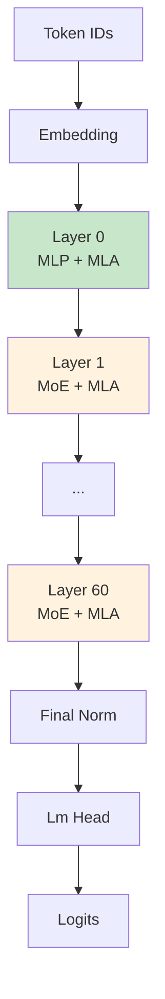
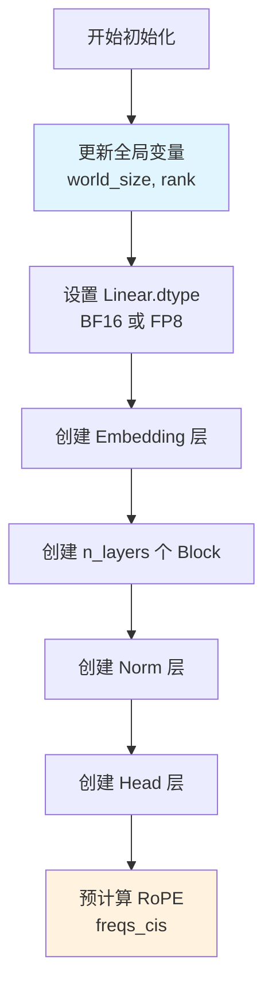
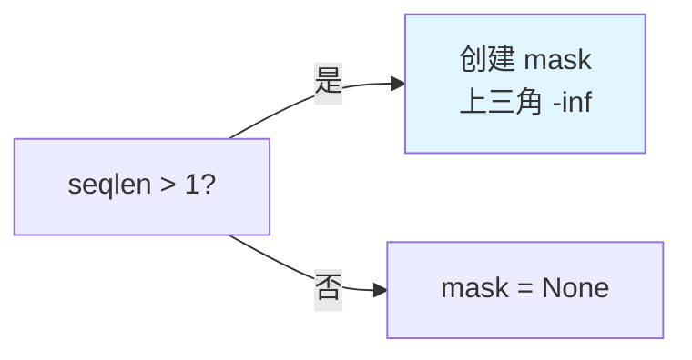
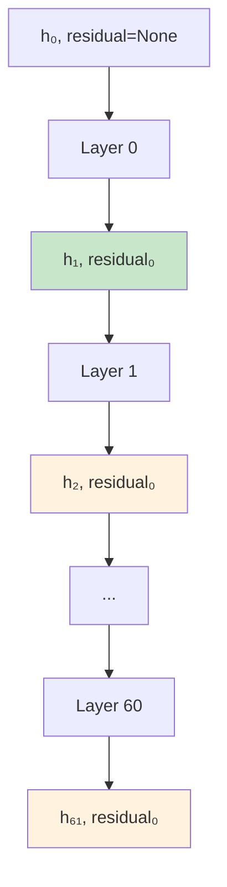
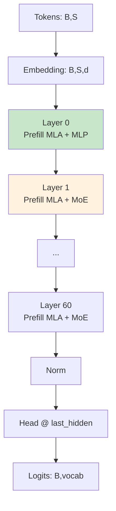
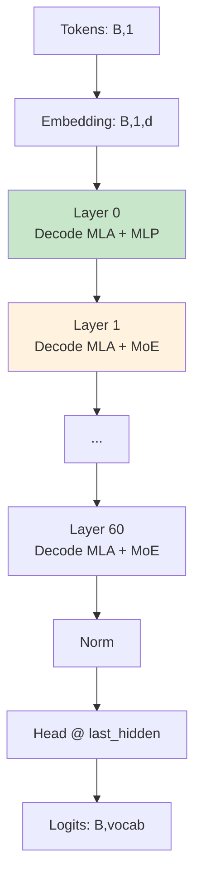

# MODEL_TRANSFORMER.md - 完整 Transformer 模型详解

## 目录

- [1. 概述](#1-概述)
- [2. Transformer 类定义](#2-transformer-类定义)
- [3. __init__ 方法详解](#3-__init__-方法详解)
- [4. forward 方法详解](#4-forward-方法详解)
- [5. 完整数据流](#5-完整数据流)

## 1. 概述

**Transformer** 是 DeepSeek-V3.2-Exp 的顶层模型类，整合了所有组件：



## 2. Transformer 类定义

### 2.1 类结构

**位置**: `model.py:L907-L967`

```python
class Transformer(nn.Module):
    def __init__(self, args: ModelArgs):
        super().__init__()
        self.max_seq_len = args.max_seq_len
        self.embed = ParallelEmbedding(args.vocab_size, args.dim)
        self.layers = torch.nn.ModuleList()
        for layer_id in range(args.n_layers):
            self.layers.append(Block(layer_id, args))
        self.norm = RMSNorm(args.dim)
        self.head = ColumnParallelLinear(args.dim, args.vocab_size, dtype=torch.float32)
        self.register_buffer("freqs_cis", precompute_freqs_cis(args), persistent=False)
```

### 2.2 主要组件

| 组件 | 类 | 说明 |
|------|-----|------|
| `embed` | ParallelEmbedding | Token 嵌入层 |
| `layers` | ModuleList[Block] | Transformer 层列表 |
| `norm` | RMSNorm | 最终归一化 |
| `head` | ColumnParallelLinear | 语言模型头 |
| `freqs_cis` | Tensor | 预计算的 RoPE |

## 3. __init__ 方法详解

### 3.1 完整代码

**位置**: `model.py:L919-L940`

```python
def __init__(self, args: ModelArgs):
    global world_size, rank
    world_size = dist.get_world_size() if dist.is_initialized() else 1
    rank = dist.get_rank() if dist.is_initialized() else 0
    Linear.dtype = torch.float8_e4m3fn if args.dtype == "fp8" else torch.bfloat16
    Linear.scale_fmt = args.scale_fmt
    super().__init__()
    self.max_seq_len = args.max_seq_len
    self.embed = ParallelEmbedding(args.vocab_size, args.dim)
    self.layers = torch.nn.ModuleList()
    for layer_id in range(args.n_layers):
        self.layers.append(Block(layer_id, args))
    self.norm = RMSNorm(args.dim)
    self.head = ColumnParallelLinear(args.dim, args.vocab_size, dtype=torch.float32)
    self.register_buffer("freqs_cis", precompute_freqs_cis(args), persistent=False)
```

### 3.2 初始化流程



### 3.3 全局变量更新

```python
# model.py:L926-L928
global world_size, rank
world_size = dist.get_world_size() if dist.is_initialized() else 1
rank = dist.get_rank() if dist.is_initialized() else 0
```

**作用**：
- 更新 `model.py` 顶部的全局变量
- 确保所有模块使用正确的并行配置

### 3.4 数据类型配置

```python
# model.py:L929-L930
Linear.dtype = torch.float8_e4m3fn if args.dtype == "fp8" else torch.bfloat16
Linear.scale_fmt = args.scale_fmt
```

**影响**：
- 所有 `Linear` 层的权重数据类型
- 影响后续的 `act_quant` 调用

### 3.5 组件形状

| 组件 | 形状 | 说明 |
|------|------|------|
| `embed.weight` | $(vocab/8, d)$ | 并行切分 |
| `layers` | 列表[61] | 61 个 Block |
| `norm.weight` | $(d,)$ | 归一化参数 |
| `head.weight` | $(vocab/8, d)$ | 并行切分 |
| `freqs_cis` | $(S_{max}, d_{rope}/2)$ | 复数 |

## 4. forward 方法详解

### 4.1 函数签名

**位置**: `model.py:L942-L966`

```python
@torch.inference_mode()
def forward(self, tokens: torch.Tensor, start_pos: int = 0):
```

| 参数 | 形状 | 说明 |
|------|------|------|
| `tokens` | $(B, S)$ | Token IDs |
| `start_pos` | int | 起始位置 |

### 4.2 完整流程

```mermaid
flowchart TD
    A[输入 tokens<br/>(B, S)] --> B[Embedding<br/>h = embed tokens]
    B --> C[创建 mask<br/>causal if S>1]
    C --> D[获取 freqs_cis<br/>freqs_cis[start_pos:end_pos]]

    D --> E[初始化 residual=None]
    E --> F{遍历所有层}

    F --> G[Layer.forward<br/>h, residual]
    G --> H{还有层?}
    H -->|是| F
    H -->|否| I[Final Norm<br/>h, _ = norm h, residual]

    I --> J[Lm Head<br/>logits = head h]
    J --> K{多卡?}
    K -->|是| L[AllGather<br/>收集完整 logits]
    K -->|否| M[返回 logits]
    L --> M

    style G fill:#e1f5ff
    style I fill:#fff3e0
```

### 4.3 逐行代码解读

#### 4.3.1 准备阶段

```python
# model.py:L954-L956
seqlen = tokens.size(1)
freqs_cis = self.freqs_cis[start_pos:start_pos+seqlen]
mask = torch.full((seqlen, seqlen), float("-inf"), device=tokens.device).triu_(1) if seqlen > 1 else None
```

**Causal Mask**：
- Prefill (`seqlen > 1`): 创建上三角 mask
- Decode (`seqlen = 1`): mask = None



#### 4.3.2 Embedding

```python
# model.py:L957
h, residual = self.embed(tokens), None
```

**形状变化**：$(B, S) \rightarrow (B, S, d)$

#### 4.3.3 Layer 循环

```python
# model.py:L958-L959
for layer in self.layers:
    h, residual = layer(h, residual, start_pos, freqs_cis, mask)
```

**数据流**：



#### 4.3.4 最终归一化

```python
# model.py:L960
h, _ = self.norm(h, residual)
```

**合并残差**：
```python
# RMSNorm.forward 带残差模式
x = residual = x.float() + residual.float()  # 真正合并
var = x.pow(2).mean(-1, keepdim=True)
x = x * torch.rsqrt(var + self.eps)
return (self.weight * x).to(dtype), residual.to(dtype)
```

#### 4.3.5 Lm Head

```python
# model.py:L961
logits = self.head(h[:, -1].float())
```

**取最后一个 token**：
- `h[:, -1]`: 取最后一个时间步
- 形状: $(B, S, d) \rightarrow (B, d)$

**Head 投影**：
- `head.weight`: $(vocab/8, d)$
- 输出: $(B, vocab/8)$

#### 4.3.6 多卡 AllGather

```python
# model.py:L962-L965
if world_size > 1:
    all_logits = [torch.empty_like(logits) for _ in range(world_size)]
    dist.all_gather(all_logits, logits)
    logits = torch.cat(all_logits, dim=-1)
```

**多卡 Logits 合并**：

```mermaid
flowchart TD
    A[GPU 0: logits₀<br/>(B, vocab/8)] --> D[AllGather]
    B[GPU 1: logits₁<br/>(B, vocab/8)] --> D
    C[GPU 7: logits₇<br/>(B, vocab/8)] --> D

    D --> E[拼接<br/>(B, vocab)]

    style D fill:#e1f5ff
```

## 5. 完整数据流

### 5.1 Prefill 阶段



### 5.2 Decode 阶段



### 5.3 张量形状演变

假设 $B=1, S=1$ (decode), $d=2048$：

| 阶段 | 形状 | 说明 |
|------|------|------|
| tokens | $(1, 1)$ | Token IDs |
| embed | $(1, 1, 2048)$ | 嵌入 |
| Layer 0 输入 | $(1, 1, 2048)$ | - |
| Layer 0 输出 | $(1, 1, 2048)$ | - |
| ... | ... | ... |
| Layer 60 输出 | $(1, 1, 2048)$ | - |
| norm 输入 | $(1, 1, 2048)$ | + residual |
| norm 输出 | $(1, 1, 2048)$ | 归一化 |
| last hidden | $(1, 2048)$ | 取最后时间步 |
| logits (单卡) | $(1, 12800)$ | vocab/8 |
| logits (8卡) | $(1, 102400)$ | 完整 vocab |

### 5.4 内存占用估算

**671B 模型，8 卡 tensor parallelism**：

| 组件 | 单卡大小 | 说明 |
|------|----------|------|
| 权重 | ~85 GB | FP16/BF16 |
| KV Cache | ~8 GB | bsz=1, seq=16384 |
| 激活值 | ~10 GB | 估算 |
| **总计** | **~103 GB** | 需要 A100 80GB×2 或 H200 |

---

**下一步**: 阅读 [GENERATE.md](GENERATE.md) 了解生成循环的实现。
