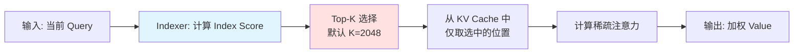
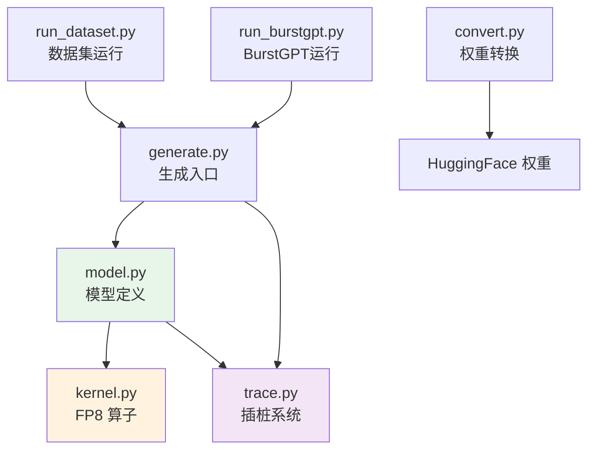
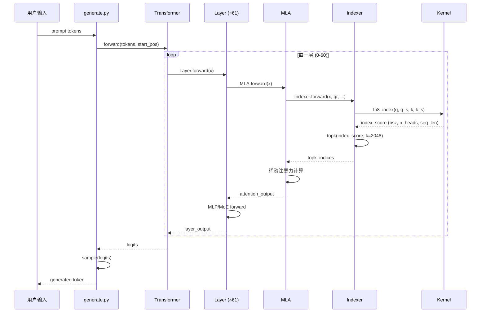
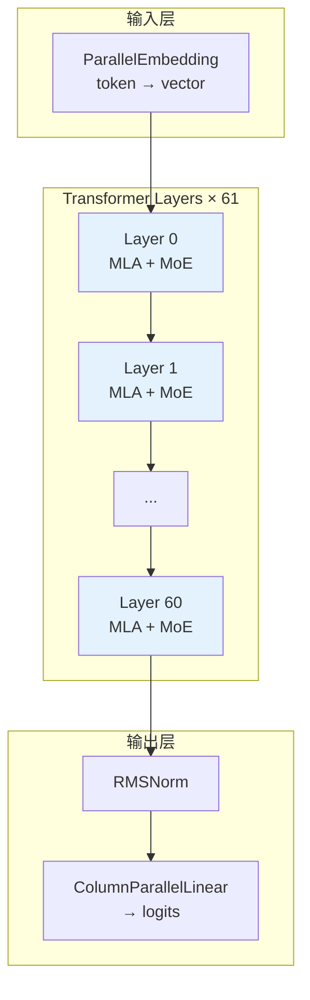

# DeepSeek-V3.2-Exp 推理代码总览

## 目录

- [1. 项目简介](#1-项目简介)
- [2. 核心技术特点](#2-核心技术特点)
- [3. 目录结构](#3-目录结构)
- [4. 文件依赖关系](#4-文件依赖关系)
- [5. 核心数据流](#5-核心数据流)
- [6. 模型架构概览](#6-模型架构概览)
- [7. 文档导航](#7-文档导航)

## 1. 项目简介

DeepSeek-V3.2-Exp 是 DeepSeek 团队发布的实验性模型，引入了 **DSA (DeepSeek Sparse Attention)** 稀疏注意力机制，旨在探索长上下文场景下的训练和推理效率优化。

`inference/` 目录包含了该模型的**单机推理演示代码**，展示了：
- DSA 稀疏注意力的实现
- MLA (Multi-Head Latent Attention) 压缩机制
- MoE (Mixture of Experts) 混合专家系统
- FP8 量化和 TileLang 自定义算子
- DSA trace 插桩系统（用于分析访问模式）

## 2. 核心技术特点

### 2.1 DSA (DeepSeek Sparse Attention)

DSA 是本模型的核心创新，实现了细粒度的稀疏注意力：



**关键参数**：
- `index_n_heads`: 64 个 Indexer head
- `index_head_dim`: 128 维
- `index_topk`: 2048 (默认选中的 token 数)

### 2.2 MLA (Multi-Head Latent Attention)

MLA 通过低秩分解大幅减少 KV Cache 显存占用：

$$KV \in \mathbb{R}^{S \times (d_k + d_v)} \rightarrow KV_{latent} \in \mathbb{R}^{S \times d_{latent}}$$

| 参数 | 标准注意力 | MLA (本模型) |
|------|-----------|-------------|
| KV Cache 大小 | $S \times (d_k + d_v)$ | $S \times 512$ |
| Head 数 | 16 | 16 |
| 压缩比 | 1x | ~4x |

### 2.3 MoE (Mixture of Experts)

- `n_routed_experts`: 256 个路由专家
- `n_shared_experts`: 2 个共享专家
- `n_activated_experts`: 6 个激活专家

### 2.4 FP8 量化

- 使用 FP8 E4M3 格式存储权重和激活
- 块级量化 (block_size=128)
- 自定义 TileLang 算子加速

## 3. 目录结构

```
inference/
├── kernel.py              # TileLang FP8 算子内核
│   ├── act_quant_kernel   # 激活量化内核
│   ├── fp8_gemm_kernel    # FP8 矩阵乘法内核
│   └── fp8_index_kernel   # DSA Indexer 内核
│
├── model.py               # 模型定义
│   ├── ModelArgs          # 模型配置数据类
│   ├── ParallelEmbedding  # 并行嵌入层
│   ├── Linear             # 支持FP8的线性层
│   ├── RMSNorm/LayerNorm  # 归一化层
│   ├── Indexer            # DSA Indexer 模块 ★
│   ├── MLA                # 多头潜在注意力模块 ★
│   ├── MoE                # 混合专家系统
│   ├── MLP                # 前馈网络
│   ├── Block              # Transformer Block
│   └── Transformer        # 完整模型
│
├── generate.py            # 生成循环入口
│   ├── sample()           # 温度采样
│   ├── generate()         # 自回归生成循环
│   └── main()             # 命令行入口
│
├── convert.py             # HuggingFace 权重格式转换
│   └── main()             # 转换主函数
│
├── trace.py               # DSA trace 插桩系统
│   ├── TraceConfig        # 追踪配置
│   ├── Tracer             # 追踪器
│   ├── TraceWriter        # 异步写入器
│   └── PrefixCacheAnalyzer # 前缀缓存分析
│
├── run_dataset.py         # 数据集运行器
├── run_burstgpt.py        # BurstGPT 模拟运行器
├── sanity_trace_no_torch.py # Schema 自检脚本
├── config_671B_v3.2.json  # 671B 模型配置
└── requirements.txt       # Python 依赖
```

## 4. 文件依赖关系



**依赖说明**：
- `model.py` 依赖 `kernel.py` 中的 FP8 算子
- `model.py` 依赖 `trace.py` 进行 DSA 访问追踪
- `generate.py` 是用户入口，加载 `model.py` 和初始化 `trace.py`
- `convert.py` 独立运行，用于权重格式转换

## 5. 核心数据流

### 5.1 推理时数据流



### 5.2 前向传播张量形状演变

以下以单条请求、序列长度为 $S$ 为例：

| 阶段 | 张量 | 形状 | 说明 |
|------|------|------|------|
| 输入 | tokens | $(1, S)$ | token IDs |
| Embedding | h | $(1, S, d)$ | $d=2048$ |
| Layer 0 输入 | x | $(1, S, d)$ | - |
| Q 投影 | q | $(1, S, n_h \times d_k)$ | $n_h=16, d_k=192$ |
| K 压缩 | kv | $(1, S, d_{kv})$ | $d_{kv}=512$ |
| Indexer Q | q_idx | $(1, S, n_{idx} \times d_{idx})$ | $n_{idx}=64, d_{idx}=128$ |
| Indexer 输出 | topk_indices | $(1, S, k)$ | $k=2048$ |
| Attention 输出 | attn_out | $(1, S, n_h \times d_v)$ | $d_v=128$ |
| MLP 输出 | mlp_out | $(1, S, d)$ | - |
| 最终 logits | logits | $(1, vocab)$ | $vocab=102400$ |

## 6. 模型架构概览

### 6.1 整体架构



### 6.2 MLA 模块详细结构

```mermaid
flowchart TB
    subgraph MLA ["MLA 模块"]
        direction TB

        subgraph QPath ["Query 路径"]
            Q1[wq_a<br/>d → d_q_lora]
            QN[q_norm<br/>RMSNorm]
            Q2[wq_b<br/>d_q_lora → n_h×d_k]
        end

        subgraph KVPath ["KV 路径"]
            KV1[wkv_a<br/>d → d_kv+d_rope]
            KVN[kv_norm<br/>RMSNorm]
            KV2[wkv_b<br/>d_kv → n_h×(d_nope+d_v)]
        end

        subgraph Attn ["注意力计算"]
            ATTN[Attention<br/>Q @ K^T / √d_k]
            VOUT[Output @ V]
        end

        subgraph Index ["Indexer (DSA)"]
            IDX_Q[wq_b @ qr]
            IDX_W[weights_proj]
            IDX_K[wk @ x]
            IDX_TOP[Top-K 选择]
        end

        subgraph Output ["输出"]
            O[wo<br/>n_h×d_v → d]
        end
    end

    Q1 --> QN --> Q2
    KV1 --> KVN --> KV2
    Q2 --> ATTN
    KV2 --> ATTN
    ATT --> VOUT --> O

    IDX_Q --> IDX_TOP
    IDX_W --> IDX_TOP
    IDX_K --> IDX_TOP
    IDX_TOP -.稀疏掩码.-> ATT

    style Index fill:#ffebee
    style IDX_TOP fill:#ffcdd2
```

### 6.3 MoE 模块详细结构

```mermaid
flowchart TB
    subgraph MoE ["MoE 层 (仅 Layer 1-60)"]
        direction LR

        subgraph Gate ["门控网络"]
            G[Gate<br/>softmax → topk(6)]
        end

        subgraph Experts ["专家"]
            E1[Expert 1-64]
            E2[Expert 65-128]
            E3[Expert 129-192]
            E4[Expert 193-256]
            SE[Shared Experts × 2]
        end

        subgraph Combine ["组合输出"]
            C[加权求和<br/>+ all_reduce]
        end
    end

    Input[x] --> Gate
    Input --> Experts
    Gate --> Experts
    E1 --> C
    E2 --> C
    E3 --> C
    E4 --> C
    SE --> C

    style Gate fill:#fff3e0
    style C fill:#e8f5e9
```

## 7. 文档导航

| 文档 | 内容 | 相关代码 |
|------|------|----------|
| **[KERNEL.md](KERNEL.md)** | FP8 算子内核详解 | `kernel.py` 全部 |
| **[MODEL_BASE.md](MODEL_BASE.md)** | 模型配置与基础类 | `model.py:L1-L220` |
| **[MODEL_LINEAR.md](MODEL_LINEAR.md)** | 线性层与嵌入层 | `model.py:L93-L271` |
| **[MODEL_NORM.md](MODEL_NORM.md)** | 归一化层 | `model.py:L273-L323` |
| **[MODEL_ROPE.md](MODEL_ROPE.md)** | 旋转位置编码 | `model.py:L325-L427` |
| **[MODEL_HADAMARD.md](MODEL_HADAMARD.md)** | Hadamard 变换 | `model.py:L429-L458` |
| **[MODEL_INDEXER.md](MODEL_INDEXER.md)** | DSA Indexer 模块 ★ | `model.py:L460-L539` |
| **[MODEL_MLA.md](MODEL_MLA.md)** | MLA 注意力模块 ★ | `model.py:L549-L662` |
| **[MODEL_MOE.md](MODEL_MOE.md)** | 混合专家系统 | `model.py:L699-L858` |
| **[MODEL_MLP.md](MODEL_MLP.md)** | 前馈网络 | `model.py:L664-L697` |
| **[MODEL_BLOCK.md](MODEL_BLOCK.md)** | Transformer Block | `model.py:L860-L905` |
| **[MODEL_TRANSFORMER.md](MODEL_TRANSFORMER.md)** | 完整 Transformer | `model.py:L907-L967` |
| **[GENERATE.md](GENERATE.md)** | 生成循环详解 | `generate.py` 全部 |
| **[CONVERT.md](CONVERT.md)** | 权重格式转换 | `convert.py` 全部 |
| **[TRACE.md](TRACE.md)** | 插桩系统详解 | `trace.py` 全部 |

## 8. 符号说明

### 8.1 张量形状表示法

文档中使用的张量形状表示法：

| 符号 | 含义 | 示例 |
|------|------|------|
| $\mathbb{R}^{M \times N}$ | 实数矩阵，M行N列 | $X \in \mathbb{R}^{M \times N}$ |
| $(B, S, D)$ | 张量形状，批次×序列×维度 | $h \in (1, S, 2048)$ |
| $\lceil x \rceil$ | 向上取整 | $\lceil N/128 \rceil$ |
| $M$ | 符号变量（编译时不确定） | batch size 或 sequence length |
| $N$ | 编译时常量 | 固定的维度大小 |

### 8.2 代码位置表示法

| 格式 | 含义 | 示例 |
|------|------|------|
| `file.py:LXX` | 指定文件的第 XX 行 | `model.py:L460` |
| `file.py:LXX-LYY` | 指定文件的第 XX 到 YY 行 | `model.py:L460-L539` |
| `ClassName.method` | 类的方法 | `MLA.forward` |

### 8.3 术语对照表

| 英文 | 中文 | 说明 |
|------|------|------|
| DSA | DeepSeek Sparse Attention | DeepSeek 稀疏注意力 |
| MLA | Multi-Head Latent Attention | 多头潜在注意力 |
| MoE | Mixture of Experts | 混合专家系统 |
| KV Cache | Key-Value Cache | 键值缓存 |
| FP8 E4M3 | 8-bit Floating Point | 8位浮点数格式 |
| RoPE | Rotary Position Embedding | 旋转位置编码 |
| YaRN | Yet another RoPE extensioN | RoPE 扩展方法 |
| Prefill | 预填充阶段 | 处理 prompt 的阶段 |
| Decode | 解码阶段 | 自回归生成阶段 |

---

**下一步**：建议阅读 [KERNEL.md](KERNEL.md) 了解底层算子实现，或直接跳转到 [MODEL_INDEXER.md](MODEL_INDEXER.md) 和 [MODEL_MLA.md](MODEL_MLA.md) 了解核心模块。
