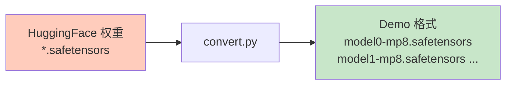

# CONVERT.md - 权重格式转换详解

## 目录

- [1. 概述](#1-概述)
- [2. 转换流程](#2-转换流程)
- [3. 参数映射](#3-参数映射)
- [4. 张量并行切分](#4-张量并行切分)

## 1. 概述

`convert.py` 将 HuggingFace 格式的权重转换为 DeepSeek-V3.2-Exp 推理 demo 使用的格式。



## 2. 转换流程

### 2.1 函数签名

**位置**: `convert.py:L37-L100`

```python
def main(hf_ckpt_path, save_path, n_experts, mp):
    torch.set_num_threads(8)
    n_local_experts = n_experts // mp
    state_dicts = [{} for _ in range(mp)]

    for file_path in tqdm(glob(os.path.join(hf_ckpt_path, "*.safetensors"))):
        with safe_open(file_path, framework="pt", device="cpu") as f:
            for name in f.keys():
                # 跳过 Layer 61
                if "model.layers.61" in name:
                    continue
                param = f.get_tensor(name)
                # 转换名称
                name = name.replace("model.", "")
                name = name.replace("self_attn", "attn")
                name = name.replace("mlp", "ffn")
                name = name.replace("weight_scale_inv", "scale")
                # 映射到新名称
                key = name.split(".")[-2]
                new_key, dim = mapping[key]
                name = name.replace(key, new_key)
                # 分配到各卡
                for i in range(mp):
                    new_param = param
                    if "experts" in name and "shared_experts" not in name:
                        idx = int(name.split(".")[-3])
                        if idx < i * n_local_experts or idx >= (i + 1) * n_local_experts:
                            continue
                    elif dim is not None:
                        shard_size = param.size(dim) // mp
                        new_param = param.narrow(dim, i * shard_size, shard_size).contiguous()
                    state_dicts[i][name] = new_param

    os.makedirs(save_path, exist_ok=True)
    for i in trange(mp):
        save_file(state_dicts[i], os.path.join(save_path, f"model{i}-mp{mp}.safetensors"))

    for file_path in glob(os.path.join(hf_ckpt_path, "*token*")):
        new_file_path = os.path.join(save_path, os.path.basename(file_path))
        shutil.copyfile(file_path, new_file_path)
```

### 2.2 流程图

```mermaid
flowchart TD
    A[开始转换] --> B[初始化 state_dicts<br/>mp 个空字典]
    B --> C[遍历 safetensors 文件]

    C --> D[打开文件<br/>safe_open]
    D --> E[遍历所有 keys]

    E --> F{是 Layer 61?}
    F -->|是| G[跳过]
    F -->|否| H[加载 tensor]

    H --> I[转换名称<br/>HF → Demo 格式]
    I --> J[分配到各卡<br/>mp 路径]

    J --> K{还有 key?}
    K -->|是| E
    K -->|否| L{还有文件?}
    G --> L
    L -->|是| C
    L -->|否| M[保存各卡权重<br/>model{i}-mp{n}.safetensors]

    M --> N[复制 tokenizer 文件]

    style J fill:#e1f5ff
    style M fill:#c8e6c9
```

## 3. 参数映射

### 3.1 映射表

**位置**: `convert.py:L11-L34`

```python
mapping = {
    "embed_tokens": ("embed", 0),
    "input_layernorm": ("attn_norm", None),
    "post_attention_layernorm": ("ffn_norm", None),
    "q_proj": ("wq", 0),
    "q_a_proj": ("wq_a", None),
    "q_a_layernorm": ("q_norm", None),
    "q_b_proj": ("wq_b", 0),
    "kv_a_proj_with_mqa": ("wkv_a", None),
    "kv_a_layernorm": ("kv_norm", None),
    "kv_b_proj": ("wkv_b", 0),
    "o_proj": ("wo", 1),
    "gate": ("gate", None),
    "gate_proj": ("w1", 0),
    "down_proj": ("w2", 1),
    "up_proj": ("w3", 0),
    "norm": ("norm", None),
    "lm_head": ("head", 0),
    "scale": ("scale", None),
    "wq_b": ("wq_b", None),
    "wk": ("wk", None),
    "k_norm": ("k_norm", None),
    "weights_proj": ("weights_proj", None),
}
```

### 3.2 名称转换示例

| HF 格式 | Demo 格式 | 说明 |
|----------|-----------|------|
| `model.embed_tokens.weight` | `embed.weight` | 嵌入层 |
| `model.layers.0.input_layernorm.weight` | `layers.0.attn_norm.weight` | 归一化 |
| `model.layers.0.self_attn.q_proj.weight` | `layers.0.attn.wq_b.weight` | Q 投影 |
| `model.layers.0.mlp.gate_proj.weight` | `layers.0.ffn.gate.weight` | MLP gate |
| `model.layers.0.mlp.down_proj.weight` | `layers.0.ffn.w2.weight` | MLP down |
| `model.layers.0.mlp.up_proj.weight` | `layers.0.ffn.w3.weight` | MLP up |

## 4. 张量并行切分

### 4.1 切分维度

| 参数类型 | 切分维度 | 说明 |
|----------|----------|------|
| 列并行 (dim=0) | 0 | 输出维度切分 |
| 行并行 (dim=1) | 1 | 输入维度切分 |
| 无切分 (None) | - | 不切分 |

### 4.2 切分示例

假设 `mp=8`（8 卡并行），权重形状为 `(4096, 2048)`：

```mermaid
flowchart TD
    A[原始权重<br/>(4096, 2048)] --> B{切分维度?}

    B -->|dim=0| C[列并行<br/>按输出切分]
    B -->|dim=1| D[行并行<br/>按输入切分]
    B -->|None| E[不切分<br/>复制到所有卡]

    C --> F[GPU 0:<br/>(512, 2048)]
    C --> G[GPU 1:<br/>(512, 2048)]
    C --> H[GPU 7:<br/>(512, 2048)]

    D --> I[GPU 0:<br/>(4096, 256)]
    D --> J[GPU 1:<br/>(4096, 256)]
    D --> K[GPU 7:<br/>(4096, 256)]

    E --> L[所有 GPU:<br/>(4096, 2048)]

    style C fill:#e1f5ff
    style D fill:#fff3e0
```

### 4.3 Expert 切分

```python
# convert.py:L72-L75
if "experts" in name and "shared_experts" not in name:
    idx = int(name.split(".")[-3])
    if idx < i * n_local_experts or idx >= (i + 1) * n_local_experts:
        continue
```

**逻辑**：
- 64 个专家分配到 8 个卡
- 每个卡负责 8 个专家（Expert 0-7, 8-15, ..., 56-63）
- 仅将分配给当前卡的专家添加到 state_dict

### 4.4 输出文件

| 文件 | 内容 | 大小 |
|------|------|------|
| `model0-mp8.safetensors` | GPU 0 的权重 | ~85 GB |
| `model1-mp8.safetensors` | GPU 1 的权重 | ~85 GB |
| ... | ... | ... |
| `model7-mp8.safetensors` | GPU 7 的权重 | ~85 GB |
| `tokenizer.json` | Tokenizer 配置 | ~1 MB |
| `tokenizer_config.json` | Tokenizer 配置 | ~10 KB |

---

**下一步**: 阅读 [TRACE.md](TRACE.md) 了解 DSA trace 插桩系统的实现。
